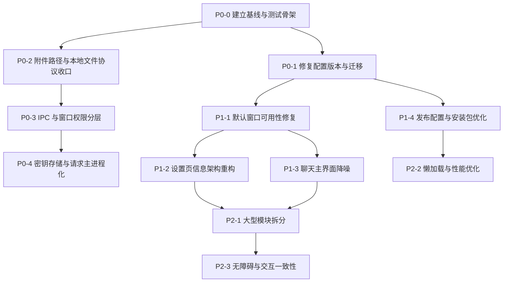

# NeoDeskPet 代码审查修复路线图

- 日期：2026-07-13
- 状态：P2-1 进行中（第四十一批：Memory persona、目录管理与保留度维护已拆分）
- 适用项目：NeoDeskPet Electron
- 目标：按风险和依赖顺序修复配置迁移、安全边界、默认窗口体验、发布质量与架构债务

> 本文仅定义开发顺序和验收标准。在用户明确下达执行口令前，不修改运行时代码、不调整配置、不安装新依赖。

## 1. 总体结论

当前项目已经具备桌宠、聊天、长期记忆、任务 Agent、MCP、浏览器控制、视觉路由、TTS、ASR、NovelAI 和悬浮球等完整能力，主要问题已经从“功能缺失”转为以下四类：

1. 数据升级链路存在确定性缺陷，可能影响老用户配置。
2. Electron 高权限能力暴露范围过大，附件路径和密钥需要收口。
3. 默认窗口尺寸与当前信息量不匹配，部分设置入口在新用户默认尺寸下不可见。
4. 核心文件和发布产物持续膨胀，缺少自动化测试作为重构安全网。

推荐执行顺序：

```text
建立验证基线
  -> 修复配置迁移
  -> 收紧文件与 IPC 权限
  -> 改造密钥存储
  -> 修复默认窗口可用性
  -> 重构设置和聊天信息架构
  -> 完善发布配置与缩减体积
  -> 拆分大型模块并补齐长期测试
```

## 2. 优先级定义

| 优先级 | 含义 | 执行原则 |
| --- | --- | --- |
| P0 | 可能导致数据升级错误、敏感信息泄露或高权限能力被滥用 | 在继续扩展功能前完成 |
| P1 | 直接影响新用户可用性、核心操作效率和正式发布质量 | P0 稳定后立即完成 |
| P2 | 影响维护成本、性能、可测试性和无障碍体验 | 可按模块连续推进 |
| P3 | 产品增强和长期体验优化 | 不阻塞当前稳定版本 |

## 3. 依赖关系



## 4. P0-0：建立修复基线与最小测试骨架

### 目标

在修改配置迁移和安全边界前，先建立可以重复执行的验证入口，避免修复过程中出现静默回归。

### 计划改动

- 增加项目级测试命令，优先使用轻量 TypeScript 测试框架。
- 为纯函数和边界校验建立首批测试目录。
- 固化默认窗口截图尺寸：Chat 420 x 560、Settings 420 x 520、Memory 560 x 720、Orb panel 560 x 720。
- 记录当前配置文件、数据库和附件目录的备份策略。
- 将验证命令统一写入 `package.json` 和 `verification.md`。

### 首批必须覆盖的测试

1. 配置迁移版本选择。
2. 配置 normalize 的向后兼容。
3. 本地附件路径允许/拒绝规则。
4. IPC sender 权限判断。
5. Markdown URL 与本地图片路径处理。
6. 聊天消息归并和工具块解析。

### 涉及文件

- `package.json`
- `electron/store.ts`
- `electron/main.ts`
- `src/components/MarkdownMessage.tsx`
- 新增 `tests/` 或与源码同目录的测试文件
- `verification.md`

### 验收标准

- `npm run lint` 通过。
- `npx tsc --noEmit` 通过。
- 新增测试命令可独立运行并通过。
- 测试不依赖真实 API Key、真实模型或用户数据库。
- 默认尺寸基线截图可重复生成。

### 风险与回滚

- 本阶段原则上不改变运行时行为。
- 如果测试依赖与 Electron/Vite 冲突，应先缩小到 Node 侧纯函数测试，不强行引入复杂 E2E 框架。

### P0-0 实施记录（2026-07-13）

- 已使用 Vitest 建立 `npm test` 和 `npm run test:watch`。
- 已新增迁移选择、设置 normalize、媒体路径、IPC 权限、Markdown 本地路径和聊天消息处理测试。
- 已新增 `npm run ui:baseline`，构建后自动生成以下默认尺寸截图：
  - Chat：420 x 560
  - Settings：420 x 520
  - Memory：560 x 720
  - Orb panel：560 x 720
- 截图与布局报告输出到 `artifacts/ui-baseline/`，该目录不进入 Git。
- P0-0 只建立边界与验证能力；迁移版本不一致的实际修复仍属于 P0-1。
- Windows unpacked 打包已通过；验证命令临时关闭 EXE 签名/元数据编辑，以绕过当前机器缺少符号链接权限的问题，未修改项目打包配置。

### 用户数据备份与恢复基线

执行 P0-1、P0-2 或 P0-4 前必须完全退出 NeoDeskPet，并备份整个 Electron `app.getPath('userData')` 目录。最小备份范围包括：

- `neodeskpet-settings.json`
- `neodeskpet-chat.sqlite3` 及可能存在的 `-wal`、`-shm`
- `neodeskpet-memory.sqlite3` 及可能存在的 `-wal`、`-shm`
- `neodeskpet-tasks.json`
- `chat-attachments/`
- 任务输出、视频分析缓存和 debug 日志（按排障需要保留）

备份必须写到 `userData` 目录之外，并使用带时间戳的独立目录或压缩包。恢复时保持应用关闭，先另存失败现场，再整体替换备份文件；不得只恢复 SQLite 主文件而遗漏同一时刻的 WAL/SHM。

## 5. P0-1：修复应用版本与配置迁移

### 已确认问题

- 修复前 `package.json` 版本为 `0.1.0`。
- `electron/store.ts` 中迁移版本已经到 `0.21.0`。
- `electron-store` 默认使用 `app.getVersion()` 作为迁移目标版本。
- 因此当前运行时不会执行 `0.2.0` 到 `0.21.0` 的迁移。

### 实施步骤

1. 确认当前正式发布版本策略，禁止应用版本和迁移版本继续分离。
2. 在执行任何迁移前备份设置、聊天数据库、记忆数据库和任务状态文件。
3. 审核 `0.2.0` 到 `0.21.0` 的每一个迁移，保证重复执行不会破坏数据。
4. 将应用版本提升到不低于当前最高迁移版本，或显式维护独立且可靠的 schema 版本。
5. 增加从典型旧版本配置升级到当前配置的参数化测试。
6. 迁移失败时保留原始配置并显示可恢复错误，不允许直接清空用户配置。

### 推荐决策

- 短期：应用版本与最高迁移版本同步。
- 长期：每次发布先确定应用 semver，再以该版本号新增迁移，不再提前写未来版本迁移。
- 不建议只把 `projectVersion` 硬编码成一个常量后长期遗忘。

### 验收标准

- 全新安装能够生成完整默认配置。
- 从 `0.1.0` 旧配置启动时，所有目标迁移按顺序执行一次。
- 第二次启动不重复执行迁移。
- 未配置字段能够补默认值，用户已有字段不被覆盖。
- 迁移失败时原始文件和备份文件都存在。

### P0-1 实施记录（2026-07-13）

- 应用版本已从 `0.1.0` 同步到最高设置迁移版本 `0.21.0`；测试会阻止应用版本与迁移版本再次分离。
- 未继续依赖 `electron-store/conf` 的内置迁移调度。验证发现其构造阶段可能在迁移执行后用迁移前快照覆盖结果，导致版本不前进和重复迁移；现改为应用内存中按版本顺序迁移，成功后通过同目录临时文件一次性替换配置。
- 设置存储改为在主进程取得单实例锁后初始化，避免第二实例参与备份或迁移。
- 检测到旧配置、损坏配置或降级启动时，会先把完整 `userData` 快照写入同级 `<userData>-backups/` 目录；迁移失败会从快照恢复原设置文件，并显示可恢复错误和备份位置。
- `clearInvalidConfig` 已关闭，损坏 JSON 不再静默清空为默认配置；高版本配置也不会被低版本应用打开后改写。
- 已修复旧 AI 配置迁移对合法零值和视觉开关的覆盖：`temperature: 0`、自定义 token 上限、空 system prompt、视觉与流式开关均按原值保留。
- 已新增典型旧版本参数化测试、全新安装测试、第二次启动幂等测试、全量备份/失败恢复测试、降级保护测试和真实 `electron-store` 初始化集成测试。
- `npm test`、`npm run lint`、`npx tsc --noEmit` 均通过，共 9 个测试文件、27 个用例。
- 前端与 Electron main/preload 构建通过；Windows unpacked 包通过 `npx electron-builder --dir --config.win.signAndEditExecutable=false` 生成到 `release/0.21.0/win-unpacked/`。
- 打包 EXE 使用隔离旧配置完成两次启动 smoke：首次按顺序迁移到 `0.21.0`、创建完整备份并保留用户值；第二次未重复迁移或新增备份。

### 完成后才能进行

- 密钥配置结构调整。
- 默认窗口尺寸迁移。
- 发布版本和安装包命名调整。

## 6. P0-2：收紧附件路径与本地文件访问

### 已确认问题

当前 `chat:getAttachmentUrl`、`chat:readAttachmentDataUrl` 和本地 HTTP 文件服务接受 renderer 传入的绝对路径，缺少目录白名单、一次性授权和资源归属校验。

### 目标架构

```text
renderer: attachmentId / artifactId
        -> main process registry
        -> 解析到已登记的真实路径
        -> 校验允许目录、文件类型和资源状态
        -> 返回短期有效 URL
```

### 实施步骤

1. 建立统一 `LocalMediaRegistry` 或等价模块。
2. 只允许聊天附件、任务输出、截图服务产物和用户明确选择后复制进托管目录的文件登记。
3. 对路径执行 `realpath`，防止 `..`、软链接和目录穿越绕过。
4. 本地 HTTP URL 改用随机资源 token，不包含真实路径。
5. token 设置生命周期，并在应用退出或资源删除后失效。
6. 限制 MIME、文件大小、Range 请求和错误信息。
7. 将 Markdown 本地图片、聊天附件、任务图片和 Orb 预览统一接入注册表。

### 涉及文件

- `electron/main.ts`
- `electron/chatStore.ts`
- `electron/taskService.ts`
- `electron/screenCaptureService.ts`
- `electron/preload.ts`
- `src/neoDeskPetApi.ts`
- `src/components/MarkdownMessage.tsx`
- `src/components/MediaPreviews.tsx`
- `src/windows/ChatWindow.tsx`
- `src/orb/OrbApp.tsx`

### 验收标准

- 任意系统文件路径不能通过 IPC 或本地 HTTP 服务读取。
- 合法聊天附件、任务图片、视频 Range 播放仍然可用。
- URL 中不再出现 Base64 编码后的真实路径。
- 删除资源后旧 URL 不可继续读取。
- 测试覆盖目录穿越、软链接、UNC 路径、大小写差异和不存在文件。

### P0-2 实施记录（2026-07-13）

- 已新增 `LocalMediaRegistry` 与本地媒体 HTTP 服务：资源先经过托管根目录、词法路径和 `realpath` 双重校验，再签发 30 分钟有效的随机 token。
- 本地 URL 已改为 `/media/<opaque-token>`，不再包含明文路径、查询参数路径或 Base64 路径；仅支持 GET/HEAD、单 Range，并限制每段 Range、MIME 和文件大小。
- HTTP 每次读取都会重新验证资源；文件删除、真实路径变化、token 过期或应用退出后，旧 URL 立即失效。
- 允许目录收口到聊天附件、任务输出、屏幕/浏览器截图、MCP 图片、生图产物和视频托管缓存；任意系统路径、UNC、目录穿越、软链接逃逸和不存在文件均被拒绝。
- preload 不再向 renderer 暴露可自行填写的 `sourcePath`。真实拖拽/选择文件通过 Electron `webUtils.getPathForFile(file)` 获取路径，随后复制进 `chat-attachments` 并登记；renderer 伪造 `sourcePath` 不会透传到 IPC。
- 新聊天附件会保存 `resourceId`，旧消息或应用重启后的失效 ID 可用已持久化路径在主进程重新登记；任务产物仍兼容旧路径字段，但必须通过托管目录验证。
- renderer 中所有 `file://` 和本地绝对路径回退已移除。Markdown、Chat、Orb、图片预览和视频播放只有在主进程签发 URL 后才会加载本地媒体。
- `screen.capture` 输出被限制到 `userData/screenshots`；浏览器截图限制到 `task-output` 或 `browser-screenshots`，并校验父目录真实路径；外部 mmvector 视频会先复制到 `video-qa-cache`。
- `npm test`、`npm run lint`、`npx tsc --noEmit` 均通过，共 11 个测试文件、37 个用例；覆盖穿越、软链接、UNC、大小写、不存在文件、MIME/大小、Range、过期和删除失效。
- `npm run media:smoke` 使用打包后的真实 Electron/preload 验证通过：合法聊天附件与相对任务产物可用，外部路径和伪造 `sourcePath` 被拒绝，真实选择文件复制成功，URL 不泄露路径，视频 Range 为 206，删除后旧 URL 为 404。
- `npm run ui:baseline` 通过，Chat、Settings、Memory、Orb 四窗口无 console error、无水平或垂直溢出；Windows unpacked 包已重新生成。

## 7. P0-3：IPC sender 校验与窗口能力分层

### 目标

把“本应用创建的任意 renderer 都拥有全部能力”改为“每种窗口只有完成自身任务所需的最小能力”。

### 实施步骤

1. 为每个 BrowserWindow 注册可信窗口类型和 `webContents.id`。
2. 建立统一 IPC 授权助手，例如 `assertTrustedSender(event, ['chat', 'settings'])`。
3. 按领域拆分 preload API：Pet、Chat、Settings、Memory、Orb 各自只暴露需要的能力。
4. 所有高风险 handler 必须声明允许的窗口类型。
5. 设置 `will-navigate` 和 `setWindowOpenHandler`，应用窗口禁止导航到远程页面，外部链接交给系统浏览器。
6. 拒绝未知窗口、子 frame 和非应用来源调用 IPC。
7. 增加 CSP，并检查 Live2D 脚本加载方式所需的本地白名单。

### 首批高风险 IPC

- `app:quit`
- 所有 `settings:set*`
- `chat:readAttachmentDataUrl`
- `chat:getAttachmentUrl`
- Task 创建、暂停、恢复和取消
- Memory 删除与批量修改
- MCP 配置和同步
- TTS HTTP 代理
- 窗口拖拽和显示模式切换

### 验收标准

- 每个窗口只能调用白名单内 API。
- 远程页面无法获得 NeoDeskPet preload 能力。
- 外部链接不会在带 preload 的 Electron 子窗口中打开。
- 非法 sender 调用会返回统一错误并记录安全日志。
- 正常的 Pet、Chat、Settings、Memory 和 Orb 工作流不受影响。

### P0-3 实施记录（2026-07-13）

- 已为 Pet、Chat、Settings、Memory、Orb 和 Orb Menu 建立可信 `webContents.id -> WindowType` 注册表，窗口销毁时同步撤销身份。
- 118 个 `ipcMain.handle/on` 入口已全部改由统一包装器注册；每次调用都会校验已登记窗口、主 frame、frame URL、当前 webContents URL 和通道白名单，非法调用统一返回 `IpcSecurityError` 并写入安全日志。
- 已建立完整 IPC 权限矩阵和覆盖检查；测试会扫描 `electron/main.ts`，阻止新增未声明通道、重复通道或绕过统一包装器的直接注册。
- preload 会读取主进程注入的窗口类型参数，并按 Pet、Chat、Settings、Memory、Orb、Orb Menu 分别裁剪 API；测试会扫描各窗口源码，防止正常工作流所需方法被遗漏。
- 所有窗口已显式启用 `contextIsolation`、关闭 `nodeIntegration` 并启用 renderer sandbox；未知窗口参数不再暴露 NeoDeskPet API。
- 已设置 `will-navigate`、`will-redirect` 和 `setWindowOpenHandler`：非应用导航被阻止，HTTP/HTTPS 外链交给系统浏览器，Electron 子窗口始终拒绝创建。
- 已增加严格 CSP；Pixi 通过 `@pixi/unsafe-eval@6.5.10` 的无动态代码生成兼容实现运行，不需要在 CSP 中放开 `'unsafe-eval'`。
- 打包验证同时修复了 Live2D 根路径在 `file://` 环境解析到磁盘根目录、生产模型扫描指向不存在的 `app.asar.unpacked` 等问题；默认模型可在 ASAR 包内正常加载。
- `npm test`、`npm run lint`、`npx tsc --noEmit`、Vite/Electron/preload 构建、Windows unpacked 打包、`npm run media:smoke` 和 `npm run ui:baseline` 均通过。
- 新增 `npm run ipc:smoke`：真实启动打包后的 Electron，验证五类主窗口 API 表、无运行时错误、路由伪装拒绝、非法导航阻止和子窗口阻止。

## 8. P0-4：密钥存储与网络请求边界

### 已确认问题

- API Key 位于普通配置对象中。
- `settings:get` 和 `settings:changed` 会把完整 Key 返回所有 renderer。
- 开发环境还会把完整 settings 输出到 console。
- AI 请求主体目前大量位于 renderer 服务中。

### P0-4A：立即止血

- 删除完整 settings console 输出。
- Debug log 增加敏感字段脱敏：`apiKey`、`token`、`authorization`、`password`、Cookie 等。
- 向非设置窗口返回脱敏配置，只保留 `hasApiKey`。
- 设置页保存 Key 时使用独立 IPC，不通过设置广播回传明文。

### P0-4A 实施进度（2026-07-13）

- 已移除 renderer 启动入口对完整 settings 对象的控制台输出。
- Debug log 已增加递归敏感字段脱敏，覆盖 `apiKey`、`authorization`、`password`、Cookie、secret、credential 和字符串 token；同时清洗 Bearer/Basic 凭证及 URL 查询参数中的密钥。
- 数值型 token 用量（例如 `promptTokens`、`completion_tokens`）仍正常保留，便于排障和上下文统计。
- 五类 renderer 窗口接收的 settings 已统一脱敏，只保留 `hasApiKey` / `has...ApiKey` 状态；设置窗口也不会读取已有明文密钥。
- 设置页通过仅 settings 窗口可调用的 `settings:setSecret` 写入或清除密钥；通用设置 IPC 会拒绝携带密钥字段。

### P0-4B：完整改造

- 使用 Electron `safeStorage` 加密密钥。
- 配置文件只保存密钥引用或加密值。
- AI、视觉、Embedding、Reranker、NovelAI 和工具模型请求逐步迁移到主进程。
- renderer 只提交请求参数和 profile ID，不接触明文 Key。
- 提供清除密钥、重新输入和密钥不可解密时的恢复流程。

### 验收标准

- renderer console、debug log、settings 广播中不存在明文 Key。
- 普通窗口无法读取密钥。
- 配置文件中不存在可直接使用的明文 Key。
- 系统密钥不可解密时不会静默丢失其他设置。
- OpenAI 兼容、Claude、视觉、Embedding、NovelAI 和工具 API 均通过回归测试。

### P0-4 完成记录（2026-07-13）

- 新增 `SettingsSecretStore`，使用 Electron `safeStorage` 加密主 AI、AI Profile、NovelAI、工具 AI、自动提炼、向量、多模态向量和 KG 密钥；普通 settings 文件只保留空值，加密值独立写入 `neodeskpet-secrets.json`。
- 首次迁移明文密钥前会创建完整 userData 备份；加密不可用时不改写原配置。密钥文件损坏或不可解密时提供“退出程序”与“保留故障文件并重置密钥后启动”两种明确恢复路径，其他设置不会被删除。
- 新增 renderer settings 投影层，`settings:get`、设置写入返回值、主进程广播和托盘广播全部统一脱敏；打包 smoke 验证 Pet、Chat、Settings、Memory、Orb 五类窗口均无法读取明文 Key。
- Chat、Memory Console 和 Orb 使用受权限控制的主进程 AI HTTP 代理；renderer 只提交请求体和 `main` / `profileId` / `memory-auto-extract` 凭据引用。代理固定使用已配置端点，负责 OpenAI/Claude 鉴权、普通响应、SSE、超时、取消、大小限制和请求归属。
- 视觉 Profile 复用主进程代理；Embedding、Reranker、NovelAI、工具模型和任务 Agent 原有网络请求均位于主进程，密钥只从主进程内存中的解密 settings 获取。
- `npm test` 共 60 个测试通过，覆盖 OpenAI、Claude/Profile、SSE、密钥迁移/恢复、renderer 脱敏和 IPC 权限；TypeScript、lint、UI baseline、Windows unpacked 打包及本地媒体 smoke 均通过。
- `npm run ipc:smoke` 使用隔离 userData 完成两次打包 EXE 启动：普通配置和加密文件均不含测试 Key 明文；重启后 renderer 仍只看到 `hasApiKey`，主进程可解密同一密钥并成功完成鉴权请求。

## 9. P1-1：默认窗口可用性热修复

### 目标

在完整 UI 重构前，先确保新用户默认尺寸下所有功能入口可见、可操作、可恢复。

### 实施步骤

1. 为 Chat、Settings、Memory 设置合理 `minWidth/minHeight`。
2. 调整新用户默认尺寸，建议候选：Chat 720 x 620、Settings 860 x 680、Memory 900 x 720。
3. 对旧用户保留已保存位置，但将过小尺寸迁移到新最小值。
4. 设置页标签在热修阶段至少支持水平滚动或 More 菜单。
5. Chat 顶部状态区在窄窗口下折叠为摘要按钮。
6. 修复 Settings 内容区偶发横向滚动。
7. 增加 100%、125%、150% Windows 缩放测试。

### 验收标准

- 默认尺寸下所有设置入口可见并可访问。
- Chat 消息区域不会被状态区长期占据三分之一。
- 页面无无意的水平滚动条。
- 窗口缩小到最小尺寸后文字、按钮和输入框不重叠。
- 多显示器切换和 DPI 变化后窗口仍可找回。

### P1-1 完成记录（2026-07-13）

- 建立统一窗口尺寸策略：Chat 默认 `720 x 620`、最小 `520 x 500`；Settings 默认 `860 x 680`、最小 `640 x 500`；Memory 默认 `900 x 720`、最小 `640 x 500`。
- 新用户使用新默认尺寸；旧配置中的过小宽高会在 normalize 阶段提升到最小值，同时保留原有 `x/y`。打包 smoke 将当前版本配置改回旧尺寸后重启，三个窗口均恢复到对应最小尺寸。
- BrowserWindow 已设置动态 `minWidth/minHeight`；当工作区本身小于策略最小时优先保证窗口可见。显示器新增、移除或 DPI/工作区变化后，会重新把现有窗口约束到可见区域。
- Settings 顶部标签改为水平滚动，不再压缩成不可读按钮；最小尺寸截图验证可滚到最后一个“语音识别”入口并成功切换。内容区禁止意外横向溢出，表单行可按可用宽度换行。
- Chat 在 `760px` 及以下显示单行状态摘要，完整记忆/工具/视觉状态按需展开；`520 x 500` 展开后状态区高度为 187px，消息区仍保留约 150px，且无横向溢出。
- UI baseline 扩展为 13 个场景，覆盖默认尺寸、最小尺寸和 100%/125%/150% 缩放；横向溢出、console/page error、状态折叠和设置标签滚动均作为失败门禁。
- `npm test` 共 63 个测试通过；TypeScript、lint、Vite/Electron/preload 构建、Windows unpacked 打包、IPC 双启动 smoke 和本地媒体 smoke 均通过。

## 10. P1-2：设置页信息架构重构

### 推荐结构

```text
外观
  - Live2D
  - 气泡
  - 悬浮球 / 任务面板

AI 与能力
  - API 连接
  - 模型与生成
  - 视觉
  - Agent 与工具
  - 生图

角色与知识
  - 角色
  - 长期记忆
  - 设定库

语音
  - TTS
  - ASR

应用
  - 聊天界面
  - 数据与隐私
  - 备份与恢复
  - 关于
```

### 实施原则

- 使用左侧导航，不使用 11 个横向等宽标签。
- 支持设置搜索，搜索结果直接定位到具体字段。
- 高级设置默认折叠，普通用户只看到关键路径。
- API 页面拆分“连接”和“生成参数”，不再维持 3000px 以上单页。
- 对危险操作使用应用内确认对话框，逐步替换 `window.confirm/alert`。
- 每个设置项显示保存状态和错误状态。

### 验收标准

- 任意设置项最多通过两次点击到达。
- 在 860 x 680 下无需水平滚动。
- API 配置主流程无需滚动超过两个视口即可完成。
- 设置搜索能够覆盖标签、说明和常见别名。
- 键盘可以完成导航、修改和保存。

### P1-2 完成记录（2026-07-13）

- Settings 从 11 个横向标签改为左侧分组导航，按“外观 / AI 与能力 / 角色与知识 / 语音 / 应用”组织 14 个直接入口；最小尺寸下侧栏可独立滚动，任意主设置页一次点击即可到达。
- AI 长页拆分为“API 连接 / 模型与生成 / 视觉 / Agent”四个视图，共享原有状态和业务逻辑；上下文压缩参数默认折叠。`860 x 680` 下 API 连接页内容高度为 814px、可视区为 617px，低于两个视口。
- 新增可测试的设置搜索索引，覆盖字段标签、路径、说明词和常见别名；支持方向键、Enter 和 Escape。搜索结果可切换主页面及角色/记忆内部子页，并滚动高亮具体字段。
- UI 门禁验证 `endpoint -> API Base URL`、`向量 -> 角色与长期记忆 / 文本向量` 两条深层定位路径；所有搜索目标都指向已注册导航页面。
- 对所有设置写入 API 增加统一保存状态包装：标题区显示“保存中 / 已保存 / 错误”，当前聚焦设置项同步显示保存反馈；并发写入只由最新请求更新状态。
- 角色删除、记忆删除和设定删除已移除 `window.confirm`，统一使用带焦点、Escape 取消和危险操作样式的应用内确认对话框。
- UI baseline 在 13 个尺寸/缩放场景中增加左侧导航、字段搜索、保存状态、深层子页、AI 拆分、高级折叠和确认对话框门禁；`860 x 680` 与 `640 x 500` 均无横向溢出。
- `npm test` 共 72 个测试通过；TypeScript、lint、Vite/Electron/preload 构建、Windows unpacked 打包、IPC 双启动 smoke 和本地媒体 smoke 均通过。

## 11. P1-3：聊天主界面降噪与输入体验

### 实施步骤

1. 顶栏只保留会话名、新对话、状态摘要、更多菜单和关闭。
2. 将采集、召回、自动提炼、Planner、Tool Agent、游标、阈值、写入数和视觉回执移入“运行状态”抽屉。
3. 将单行 `<input>` 改为自动增高 `<textarea>`：Enter 发送、Shift+Enter 换行，输入法 composing 期间不误发。
4. 图片、视频、附件合并为一个附件菜单。
5. 清空会话移入更多菜单并增加确认。
6. 空状态增加配置模型、选择角色和导入配置入口。
7. 保留高级用户快速开关，但不作为首屏常驻信息。

### 验收标准

- 420 x 560 仍能作为紧凑窗口使用，推荐尺寸下体验完整。
- 输入框支持多行、粘贴、拖拽附件和输入法。
- 关键任务状态可见，但不会长期占据大量高度。
- 停止生成按钮在流式、TTS 和工具任务中行为一致。
- 新用户能够从空状态直接完成模型配置。

### P1-3 完成记录（2026-07-13）

- 聊天顶栏收敛为会话名、新对话、运行状态、更多和关闭；设置、记忆管理及清空当前对话进入“更多”菜单，清空操作使用支持焦点与 Escape 取消的应用内确认对话框。
- 原常驻状态条改为浮层“运行状态”抽屉，采集、召回、自动提炼、Planner、Tool Agent、模式选择、提炼游标、阈值、写入数、召回和视觉回执均保留，但默认不占用消息区高度。
- 输入框改为最高 152px 的自动增高 `<textarea>`，支持 Enter 发送、Shift+Enter 换行、输入法 composing 防误发、图片/视频粘贴与拖拽；三个附件按钮合并为单一附件菜单。
- 空状态增加配置模型、选择角色和导入配置入口；新增设置页直达协议，首次创建设置窗口通过主进程暂存目标并由设置页主动消费，已存在窗口则即时导航。
- 停止按钮统一中断流式请求、停止 TTS、清理分段语音状态并取消当前会话的活动工具任务；UI 门禁验证活动任务取消时同时调用 TTS 停止。
- Chat 最小宽度由 520 调整为 420；UI baseline 在 `420 x 560` 下验证无横向溢出、状态抽屉不挤压消息区、多行增高、输入法保护、附件菜单、设置直达、统一停止和清空确认，并继续覆盖 100% / 125% / 150% 缩放。
- `npm test` 共 72 个测试通过；TypeScript、lint、Vite/Electron/preload 构建、Windows unpacked 打包、IPC 双启动 smoke 和本地媒体 smoke 均通过。当前 Windows 环境打包使用 `--config.win.signAndEditExecutable=false` 绕过已列入 P1-4 的符号链接权限问题。

## 12. P1-4：正式发布配置与安装包优化

### 已确认问题

- `appId`、`productName`、网页标题和图标仍包含模板占位内容。
- `package.json` 缺少 description 和 author。
- 当前 release 目录中的安装包约 263.6 MB。
- `app.asar` 约 344.4 MB，Playwright 浏览器资源约 273.1 MB。
- `files` 显式包含 `node_modules/**/*`，需要核对实际必要范围。

### 实施步骤

1. 确定正式 appId、产品名、描述、作者、图标和安装器名称。
2. 清理 Vite 默认标题和图标。
3. 生成依赖体积报告，确认 asar 中最大的依赖和重复资源。
4. 仅打包生产运行所需文件。
5. 评估 Playwright 浏览器随包附带、首次使用下载、完整版/精简版三种策略。
6. 校验 native 模块的 `asarUnpack` 范围。
7. 处理 Windows 打包符号链接权限问题并固化 CI 打包环境。

### 验收标准

- Windows 安装器、应用名、任务栏和卸载项均显示正式品牌。
- 不再使用 Electron/Vite 默认图标。
- 安装包体积有可解释的组成报告。
- 精简策略不会破坏 `better-sqlite3`、Playwright、Live2D 和 MCP。
- 干净 Windows 环境可完成安装、启动、升级和卸载。

### P1-4 完成记录（2026-07-13）

- 正式品牌统一为 `NeoDeskPet`，`appId` 为 `io.github.nishichengju.neodeskpet`，作者/公司为 `nishichengju`；网页标题、窗口标题、任务栏、安装器、卸载项和版本资源均不再使用 Electron/Vite 模板占位内容。
- 新增统一品牌 SVG，并在构建时生成 16 至 1024 像素 PNG 与多尺寸 ICO；Windows EXE 通过 `resedit` after-pack 钩子写入图标和版本资源，绕开 `winCodeSign` 归档中无关 macOS 符号链接导致的 Windows 权限失败。
- 默认精简版不携带浏览器，首次使用无头浏览器能力时将匹配版本的 Chromium Headless Shell 下载到用户数据目录；`npm run build:full` 生成包含浏览器资源的离线完整版。
- 打包内容改为白名单：只保留运行时代码、七个仓库内 Live2D 示例模型、`better-sqlite3`、`bindings`、`file-uri-to-path` 和 `playwright-core`；本地私有模型、模板资源及已由 Vite 打包的重复前端依赖不会进入发行包。
- `better-sqlite3` 与 `playwright-core` 显式放入 `app.asar.unpacked`。精简版首次下载、完整版离线 Chromium 启动、SQLite/IPC、MCP/API 代理和本地媒体链路均通过实际打包产物验证。
- 精简安装器由约 263.6 MiB 降至 95.31 MiB，`app.asar` 由 343.88 MiB 降至 22.97 MiB；完整版安装器为 176.98 MiB。详细组成见 `docs/release-size-report-20260713.md`。
- 精简版与完整版安装器均完成静默安装、启动、同版本升级和卸载验证；EXE 品牌字段、多尺寸图标及应用标题均通过自动检查。
- 新增 Windows GitHub Actions 发布构建工作流，固定 Node 22，执行测试、lint、类型检查、精简版/完整版构建并上传安装器产物。

## 13. P2-1：大型模块拆分与领域边界

### 当前重点文件

- `src/windows/ChatWindow.tsx`：约 5441 行
- `electron/taskService.ts`：约 3573 行
- `electron/memoryService.ts`：约 3444 行
- `src/orb/OrbApp.tsx`：约 2792 行
- `electron/main.ts`：约 2496 行
- `electron/toolExecutor.ts`：约 2397 行

### 拆分顺序

1. `electron/main.ts`：按 settings/chat/task/memory/tts/window IPC 分模块注册。
2. `ChatWindow.tsx`：拆出会话、输入、消息列表、附件、上下文状态、AI 请求、TTS/ASR hooks。
3. `taskService.ts`：拆分任务存储、模型循环、工具执行、视觉回执和状态机。
4. `memoryService.ts`：拆分数据库、检索、Embedding、KG、维护任务和版本冲突。
5. `OrbApp.tsx`：拆分 Ball、Bar、Panel、历史、图片查看器和消息操作。

### 约束

- 不进行纯粹为了减少行数的搬运。
- 每次拆分只移动一个明确职责，并先补该职责测试。
- 不在同一提交中同时重写 UI、IPC 契约和数据库结构。
- 保持旧 API 适配层，逐步迁移调用方。

### 验收标准

- 每个拆分模块有清晰输入输出和独立测试入口。
- Chat 流式输出、停止、重发、编辑、附件和 TTS 不回归。
- Task 暂停、恢复、取消、工具重试和状态持久化不回归。
- Memory 检索、批量修改、版本回滚和维护任务不回归。

### P2-1 进展记录（2026-07-13，第一批）

- 新增 `electron/ipc/registration.ts` 作为领域 IPC 模块共用的 `IpcHandle` / `IpcOn` 注册契约；安全校验、权限判断和 renderer settings 脱敏仍集中由 `main.ts` 的统一包装器执行。
- 将 28 个 `settings:*` 通道完整迁移到 `electron/ipc/registerSettingsIpc.ts`，通过依赖注入明确设置存储、窗口动作、设置广播、Memory 补索引、MCP 同步、ASR 服务和热键同步边界。
- `electron/main.ts` 从 2743 行降至 2436 行；本批只移动设置领域，不改变通道名、权限矩阵、preload API、返回结构或错误文本。
- IPC 权限测试改为递归扫描全部 `electron/**/*.ts`，继续确保 118 个注册通道与权限矩阵一一对应、无重复、无直接绕过统一包装器的 `ipcMain.handle/on`。
- 新增设置 IPC 行为测试，覆盖 28 通道注册、密钥专用写入边界、Memory/MCP/ASR 副作用和 AI Profile 密钥继承。
- `npm test` 共 77 个用例通过；TypeScript、lint、Windows unpacked 打包、IPC 双启动 smoke、本地媒体 smoke 和 13 个 UI baseline 场景均通过。

### P2-1 进展记录（2026-07-13，第二批）

- 将 14 个 Chat 会话持久化通道迁移到 `electron/ipc/registerChatPersistenceIpc.ts`，覆盖会话列表、创建/切换/重命名/删除、消息增删改、全量消息替换和自动提炼元数据。
- 三处重复的“助手消息写入长期记忆”流程收敛为单一内部函数，继续按 persona 的 `captureUser` 决定是否拼接上一条用户消息；MemoryService 未初始化或异步摄取失败时不会影响聊天 SQLite 写入。
- `electron/main.ts` 从第一批后的 2436 行降至 2270 行；相较 P2-1 开始时累计减少 473 行。当时仍在主进程的附件与本地媒体单元已在第三批完成迁移。
- 新增 5 个 Chat 持久化 IPC 测试，覆盖 14 通道注册、会话操作委托、添加/普通编辑/结构化编辑后的记忆 turn、persona 用户采集策略、记忆关闭和故障隔离。
- 打包 IPC smoke 新增真实 SQLite 往返：创建会话、写入与编辑消息、设置提炼元数据、关闭应用、重启读取、删除消息、清空并删除会话；同时确认 Chat 写入触发的 Memory embedding 请求使用主进程密钥代理。
- `npm test` 共 82 个用例通过；TypeScript、lint、Windows unpacked 打包、IPC 双启动 smoke、本地媒体 smoke 和 13 个 UI baseline 场景均通过。

### P2-1 进展记录（2026-07-13，第三批）

- 新增 `ChatAttachmentIpcService`，将 `chat:saveAttachment`、`chat:readAttachmentDataUrl`、`chat:getAttachmentUrl` 三个通道及 MIME/扩展名解析、相对路径恢复和公开错误映射迁出 `main.ts`。
- 本地媒体允许目录、opaque token 注册表和 HTTP Server 生命周期由同一服务对象持有；应用 `will-quit` 时统一关闭端口并清理资源/token，避免主进程保留分散的可空全局状态。
- 路径边界继续由现有 `LocalMediaRegistry` 执行，没有放宽任意系统路径、UNC、软链接、文件类型或大小限制；真实选择文件仍先复制到 `userData/chat-attachments` 后才登记。
- `electron/main.ts` 从第二批后的 2270 行降至 2099 行；相较 P2-1 开始时累计减少 644 行。
- 新增 5 个附件 IPC 测试，覆盖三通道注册、data URL 保存、外部选择文件复制、相对路径恢复、opaque HTTP URL、错误脱敏、类型不匹配和服务关闭失效。
- `npm test` 共 87 个用例通过；TypeScript、lint、Windows unpacked 打包、真实 SQLite IPC smoke、本地媒体 smoke 和 13 个 UI baseline 场景均通过。

### P2-1 进展记录（2026-07-13，第四批）

- 将 8 个 Task IPC 通道迁移到 `electron/ipc/registerTaskIpc.ts`，覆盖列表、查询、工具运行图片回写、创建、暂停、恢复、取消和移除。
- 显式导出 `TaskIpcService` 输入契约；TaskService 的构造、持久化、调度器和 `onChanged` 广播生命周期仍由主进程负责，领域模块只注册稳定 IPC 适配层。
- 保留服务未就绪语义：列表返回空集合，查询/状态操作返回 `null`，只有创建任务抛出 `Task service not ready`。
- `electron/main.ts` 从第三批后的 2099 行降至 2083 行；相较 P2-1 开始时累计减少 660 行。
- 新增 3 个 Task IPC 测试，覆盖 8 通道注册、未就绪返回差异以及所有参数/返回值委托。
- `npm test` 共 90 个用例通过；TypeScript、lint、Windows unpacked 打包、IPC 双启动 smoke 和 13 个 UI baseline 场景均通过。

### P2-1 进展记录（2026-07-13，第五批）

- 将 19 个 `memory:*` IPC 通道迁移到 `electron/ipc/registerMemoryIpc.ts`，覆盖 persona 管理、记忆检索、手工写入、编辑、批量元数据、版本回滚、冲突处理和删除。
- 保留 MemoryService 未就绪时的差异化语义：persona/list/conflict/version 查询返回对应空结果，`getPersona` 返回 `null`，检索返回空 addon，写操作继续抛出 `Memory service not ready`；全局关闭记忆时检索不触发服务调用。
- 修复 SQLite persona 布尔列以 `0/1` 返回的问题，新增 `normalizePersonaStorageRow()`，确保 `captureEnabled`、`captureUser`、`captureAssistant` 与 `retrieveEnabled` 对 renderer 始终为真正的 boolean。
- `electron/main.ts` 从第四批后的 2083 行降至 1972 行；相较 P2-1 开始时累计减少 771 行。
- 新增 Memory IPC 与 persona 存储行测试，覆盖 19 个通道、未就绪/禁用路径、CRUD、版本、冲突、批量操作和 SQLite 布尔归一化；打包 IPC smoke 增加真实 persona 与手工记忆往返。
- `npm test` 共 96 个用例通过；TypeScript、lint、Windows unpacked 打包、IPC smoke、本地媒体 smoke 和 13 个 UI baseline 场景均通过。

### P2-1 进展记录（2026-07-13，第六批）

- 将 11 个 `tts:*` IPC 通道迁移到 `electron/ipc/registerTtsIpc.ts`，覆盖本地选项扫描、JSON/ArrayBuffer/流式 HTTP 代理、流取消以及 Chat 与 Pet 间的分段语音状态转发。
- `TtsIpcService` 集中持有活动流的 AbortController，继续执行原有 baseUrl 同源校验、`/tts`、`/set_gpt_weights`、`/set_sovits_weights` 路径白名单和 1 至 180 秒超时约束；应用退出时统一中止未完成流。
- `electron/main.ts` 从第五批后的 1972 行降至 1766 行；相较 P2-1 开始时累计减少 977 行。
- 新增 5 个 TTS IPC 测试，覆盖 11 个通道、选项目录回退、URL 边界、JSON/二进制响应契约、流分块/取消以及双向窗口转发。
- 打包 IPC smoke 新增真实本地 TTS 假服务，验证 JSON 权重端点、音频 ArrayBuffer、分块流、非法路径拒绝、Chat → Pet enqueue 与 Pet → Chat segmentStarted 转发。
- `npm test` 共 101 个用例通过；TypeScript、lint、Windows unpacked 打包、IPC smoke、本地媒体 smoke 和 13 个 UI baseline 场景均通过。

### P2-1 进展记录（2026-07-13，第七批）

- 将 9 个 Live2D、Bubble 与 ASR 转发通道迁移到 `electron/ipc/registerPresentationIpc.ts`，统一桌宠与 Chat 间的表情、动作、气泡、识别文本和输入基线同步。
- `PresentationIpcService` 接管 ASR 待处理文本和 Chat renderer 就绪标记：窗口未就绪时继续排队，auto-send 可按原逻辑静默创建 Chat，renderer 报告就绪后直接投递。
- 气泡 preview 继续只透传白名单字段，并对 `autoHideDelay` 执行有限数值与整数归一化；Live2D capabilities 拒绝仍记录警告，不影响窗口运行。
- `electron/main.ts` 从第六批后的 1766 行降至 1661 行；相较 P2-1 开始时累计减少 1082 行。
- 新增 5 个 Presentation IPC 测试，覆盖 9 通道、Live2D 能力报告、气泡归一化、ASR 排队/清空/就绪直发、错误 sender 和 auto-send 隐藏窗口创建。
- 打包 IPC smoke 新增 Live2D 表情、气泡消息/preview、ASR compose preview、capabilities 上报和 ASR transcript 双向转发；`npm test` 共 106 个用例通过，其余构建与 smoke 门禁全部通过。

### P2-1 进展记录（2026-07-13，第八批）

- 将 20 个 Window、Orb、Drag 与 Pet 协调通道迁移到 `electron/ipc/registerWindowIpc.ts`，覆盖窗口打开/关闭、显示模式、Orb 状态与 overlay、拖拽、右键菜单、hover 和点击穿透。
- `WindowIpcService` 集中持有 Orb UI 状态和拖拽会话，保留 10 像素激活阈值、拖动期间尺寸锁定、Pet 边界持久化、Orb 侧边吸附和退出清理；应用启动恢复 Orb 模式时通过同一服务广播并设置窗口状态。
- 保留窗口 IPC 的 `void` 返回契约，避免 `ensureChatWindow()` / `ensureMemoryWindow()` 返回的 BrowserWindow 被 Electron 尝试序列化；设置深链、非法 Orb 输入和无效拖拽 sender 仍按原语义处理。
- `electron/main.ts` 从第七批后的 1661 行降至 1299 行；相较 P2-1 开始时累计减少 1444 行，路线图中的 settings/chat/task/memory/tts/window IPC 分域注册目标已完成。
- 新增 5 个 Window IPC 测试，覆盖 20 通道、窗口/深链、Orb 往返、overlay、拖拽阈值与尺寸锁定、吸附、菜单副作用、hover 身份和 ignore-mouse 参数。
- 打包 IPC smoke 新增真实 Orb `ball → panel → ball`、overlay 设置/清理与启动 displayMode 接线；`npm test` 共 111 个用例通过，其余构建、媒体和 UI 门禁全部通过。P2-1 下一步进入 `ChatWindow.tsx` 组件与 hooks 拆分。

### P2-1 进展记录（2026-07-13，第九批）

- 将 Chat 消息图片查看器从 `ChatWindow.tsx` 迁移到 `src/windows/chat/ImageViewer.tsx`，独立封装图片选择、缩放、拖拽、重置、前后切换和 Esc 关闭。
- 保留原有 DOM class、按钮文案、0.2 至 8 倍缩放范围、滚轮步长、索引边界和 transform 语义；`ChatMessageItem` 继续只持有查看器开关与当前索引。
- `ChatWindow.tsx` 从 5636 行降至 5546 行；本批只移动 ImageViewer 职责，不修改会话、消息、附件、AI 请求或 TTS 状态。
- 新增 2 个服务端渲染测试，覆盖选中图片、位置/缩放元数据、导航边界、操作提示和无有效 item 时的空渲染。
- UI baseline 新增独立图片消息场景，实际打开查看器、验证 `1 / 1`、`100%`、无横向溢出与 Esc 关闭，并保存打开态截图；基线场景由 13 个增加到 14 个。
- `npm test` 共 113 个用例通过；TypeScript、lint、Windows unpacked 打包、IPC smoke、本地媒体 smoke 和 14 个 UI baseline 场景均通过。下一批继续拆分 `ChatMessageItem`。

### P2-1 进展记录（2026-07-13，第十批）

- 将单条消息的图片/视频附件渲染迁移到 `src/windows/chat/ChatMessageAttachments.tsx`，将新旧附件字段归一化迁移到纯工具 `messageAttachments.ts`。
- 组件继续支持 `attachments`、`imagePath`、`videoPath` 与旧 `image` data URL；保留 resourceId、文件名、LocalVideo、主进程媒体 URL 打开和多图查看器索引语义。
- 工具调用消息仍通过 `hidden` 跳过普通附件区域，避免工具图片同时出现在工具卡和消息附件中；父级 `ChatMessageItem` 只传入消息、API 与查看器回调。
- `ChatWindow.tsx` 从第九批后的 5546 行降至 5446 行；相较 Chat 拆分开始时累计减少 190 行。
- 新增 3 个附件测试，覆盖持久化附件清洗、无效项忽略、legacy 字段回退、data URL 渲染和隐藏态空输出。
- `npm test` 共 116 个用例通过；TypeScript、lint、Windows unpacked 打包、IPC smoke、本地媒体 smoke 和 14 个 UI baseline 场景均通过。下一批继续拆分工具运行卡与 `ChatMessageItem` 主体。

### P2-1 进展记录（2026-07-13，第十一批）

- 将真实工具运行、旧任务步骤兜底和多模态结果渲染迁移到 `src/windows/chat/ChatToolUseCard.tsx`，将 mmvector 输出解析、媒体地址归一化和工具图片路径筛选迁移到纯工具 `toolUseMedia.ts`。
- 组件继续按 `runId` 精确渲染单次调用，过滤 `agent.run` 外壳 run/step，并保留运行状态、进度、输入/输出/错误详情、图片重新生成与回写、工具图片查看器、多模态图片/视频预览和媒体打开语义。
- 工具卡内部持有单次图片重生成状态，映射多个 run 时为顶层 Fragment 补充稳定 key；`ChatMessageItem` 只负责从 `tasksById` 取任务并传入消息级回调。
- `ChatWindow.tsx` 从第十批后的 5446 行降至 5221 行；相较 Chat 拆分开始时累计减少 415 行。
- 新增 4 个工具卡测试，覆盖 mmvector 纯 JSON/日志包裹解析、`runId` 精确选择、Agent 外壳过滤、生成图片安全筛选、多模态图片/视频结果和旧步骤失败兜底。
- UI baseline 新增工具卡浏览器场景，实际加载带 `runId` 的消息、展开卡片、验证输入/输出详情和无横向溢出，并保存展开态截图；同时将既有深层设置搜索从固定延迟改为状态条件等待，基线场景由 14 个增加到 15 个。
- `npm test` 共 120 个用例通过；TypeScript、lint、Windows unpacked 打包、IPC smoke、本地媒体 smoke 和 15 个 UI baseline 场景均通过。下一批继续拆分 `ChatMessageItem` 消息主体。

### P2-1 进展记录（2026-07-13，第十二批）

- 将单条消息的头像、普通气泡、分段 TTS 气泡、Markdown/status/tool block 顺序、行内编辑器和附件/overlay 插槽迁移到 `src/windows/chat/ChatMessageBody.tsx`。
- `ChatMessageItem` 继续负责附件 URL 到 ImageViewer item 的解析、任务查找与 ToolUse 卡组合；消息主体不接触会话状态、持久化 API 或任务更新，保持现有 block 与编辑保存契约。
- 分段模式继续按 `revealCount` 截取可见段、清理尾逗号并只把附件放在最后一个可见气泡；存在工具 block 或编辑态时仍回到普通单气泡布局，零可见段继续不渲染消息与 overlay。
- `ChatWindow.tsx` 从第十一批后的 5221 行降至 5106 行；相较 Chat 拆分开始时累计减少 530 行。
- 新增 4 个消息主体测试，覆盖 Markdown/status/tool block 顺序、助手 fallback/头像/overlay、用户编辑态隐藏原内容与附件、分段增量揭示及零段空输出。
- 既有紧凑 Chat UI baseline 增加真实用户消息右键编辑流程，验证编辑器初值、编辑态截图与保存后文本更新；连同图片查看器和工具卡场景共 15 个基线场景全部通过。
- `npm test` 共 124 个用例通过；TypeScript、lint、Windows unpacked 打包、IPC smoke、本地媒体 smoke 和 15 个 UI baseline 场景均通过。下一批继续拆分会话列表与 composer。

### P2-1 进展记录（2026-07-13，第十三批）

- 将会话列表 overlay、活动会话样式、消息计数、重命名输入与删除/重命名操作迁移到 `src/windows/chat/ChatSessionList.tsx`；会话数据、当前会话和持久化 API 继续由 `ChatWindow` 持有。
- 组件继续沿用现有 DOM class、列表位置和受控重命名状态；Enter 现在通过 blur 统一提交，避免原实现 keydown 与 blur 可能重复调用重命名 API，Escape 仍取消编辑。
- 重命名与删除图标按钮补充包含会话名的 `aria-label`，保留现有 title、符号和点击阻止冒泡语义；新建、切换、删除后的关闭列表行为仍由父级原回调负责。
- `ChatWindow.tsx` 从第十二批后的 5106 行降至 5057 行；相较 Chat 拆分开始时累计减少 579 行。
- 新增 3 个会话列表测试，覆盖关闭态空输出、当前会话/消息计数/活动态、操作按钮可访问名称和受控重命名输入。
- 紧凑 Chat UI baseline 新增打开会话列表、进入重命名、截图、Enter 提交、名称更新与单次 API 调用断言；连同消息编辑、图片查看器和工具卡共 15 个场景全部通过。
- `npm test` 共 127 个用例通过；TypeScript、lint、Windows unpacked 打包、IPC smoke、本地媒体 smoke 和 15 个 UI baseline 场景均通过。下一批继续拆分 composer。

### P2-1 进展记录（2026-07-13，第十四批）

- 将输入框、自动增高、输入法组合态、Enter/Shift+Enter、附件菜单、三类隐藏文件 input、粘贴/拖拽媒体、待发送预览、移除操作和发送/停止按钮迁移到 `src/windows/chat/ChatComposer.tsx`。
- 将 MIME 类型分类迁移到纯工具 `composerMedia.ts`，并导出 `PendingChatAttachment` 契约；`ChatWindow` 继续持有输入文本、附件数据、ASR compose 同步、文件保存、发送流程和停止任务业务。
- composer 内部持有 textarea、composition 与文件 input refs，保留 152px 最大高度、IME 防误发、只接受图片/视频、无合法拖拽时错误提示、附件为空时禁用发送以及输出期间切换停止按钮的原语义。
- 待发送附件移除按钮补充包含文件名的 `aria-label`；附件选择菜单、预览样式和媒体保存路径/API 契约没有改变。
- `ChatWindow.tsx` 从第十三批后的 5057 行降至 4881 行；相较 Chat 拆分开始时累计减少 755 行。
- 新增 4 个 composer 测试，覆盖 MIME 分类、空输入禁用发送、隐藏文件 input、附件菜单、图片/视频预览、可访问移除按钮和输出期间停止按钮。
- 紧凑 Chat UI baseline 通过真实 file chooser 注入 PNG，验证保存后的附件预览、文件名、截图与移除；原有多行输入、IME 防误发、发送和停止任务/TTS 断言继续通过。
- `npm test` 共 131 个用例通过；TypeScript、lint、Windows unpacked 打包、IPC smoke、本地媒体 smoke 和 15 个 UI baseline 场景均通过。下一批继续拆分 Chat 的 AI/TTS/ASR hooks。

### P2-1 进展记录（2026-07-13，第十五批）

- 将 Chat renderer 的 ASR compose preview 去重、transcript 就绪握手、pending transcript 提取、手动追加、自动发送排队和窗口 focus/visibility 监听迁移到 `src/windows/chat/useChatAsr.ts`；`ChatWindow` 只保留通用发送业务并向 hook 提供稳定 refs。
- ASR 监听不再随巨型 `send` 回调和会话切换反复注销/重建，避免旧 effect 已取走主进程缓存 transcript 后因 cleanup 丢弃文本；pending transcript drain 会合并并发调用，仍保留 renderer ready/take transcript 契约。
- 自动发送统一进入单一 FIFO 队列：无当前会话时保留文本，会话就绪后继续发送；连续识别结果按顺序等待前一轮发送完成，不再因并发调用 `send` 互相中断。ASR 禁用或切到手动模式时队列暂停，不会越过当前设置发送。
- 手动模式继续把最终识别文本追加到现有输入，composer 手工编辑会同步 Pet 侧 compose base；禁用 ASR、自动发送、手动发送完成和会话变化继续按原语义发送 `clearFinals` 或当前草稿 preview。
- `ChatWindow.tsx` 从第十四批后的 4881 行降至 4691 行；相较 Chat 拆分开始时累计减少 945 行。
- 新增 5 个 ASR 控制器测试，覆盖 compose preview 去重/强制清空、手动追加、无会话排队、FIFO 冲刷、发送串行化、pending transcript drain 合并和禁用态忽略输入。
- `npm test` 共 36 个测试文件、136 个用例通过；TypeScript、lint、Windows unpacked 打包、IPC smoke、本地媒体 smoke 和 15 个 UI baseline 场景均通过。下一批继续拆分 Chat 的 AI/TTS hooks。

### P2-1 进展记录（2026-07-13，第十六批）

- 将 Chat renderer 的分段 TTS pending 占位、消息分段标记、逐段揭示计数、utterance 元数据、结束/失败事件订阅和停止重置迁移到 `src/windows/chat/useChatTts.ts`；AI 请求、文本分句和 TTS enqueue/finalize IPC 调用仍由原业务路径负责。
- 新 controller 为普通发送与重新生成提供 `begin/register/update/clear/clearAll` 生命周期接口，替代散落的多组 state/ref 手工更新；事件订阅只随 API 变化，不再因当前会话、自动提炼回调或调试状态变化反复注销和重建。
- TTS segment index 继续按原范围归一化并保持揭示计数单调递增；正常结束会按 utterance 原始 session 触发自动提炼，失败会清理状态并显示原错误，统一停止仍清空所有活跃 utterance 但保留已完成消息的分段展示标记。
- 修复 metadata 注册前 TTS 已失败/结束时 pending 占位无法清理的边角；中断重新生成时同时移除未完成消息的分段控制和元数据，避免后续迟到事件重新揭示已中断内容。
- `ChatWindow.tsx` 从第十五批后的 4691 行降至 4597 行；相较 Chat 拆分开始时累计减少 1039 行。
- 新增 6 个 TTS 控制器测试，覆盖 pending/注册、乱序 segment 单调揭示、未知/非法事件、注册前失败清理、结束后原会话回调、中断移除分段控制、全量停止重置和三类事件订阅清理。
- `npm test` 共 37 个测试文件、142 个用例通过；TypeScript、lint、Windows unpacked 打包、TTS IPC smoke、本地媒体 smoke 和 15 个 UI baseline 场景均通过。下一批继续拆分 Chat 的 AI 请求与流式响应 hooks。

### P2-1 进展记录（2026-07-13，第十七批）

- 新增 `src/windows/chat/useChatAi.ts`，集中管理 Chat AI 请求登记、`AbortController`、停止代次、同步 loading ref/state、统一中断与卸载清理；普通发送、旧重新生成 fallback 和任务完成后的二段回复已接入同一请求生命周期。
- 将非分段 TTS 的流式/非流式响应执行迁移到独立 runner：统一负责单条 assistant 消息创建与增量更新、80ms flush 节流、气泡预览、Live2D 标签去重触发、usage 更新、成功/失败落盘和自动提炼回调；planner、Tool Agent、记忆召回、上下文压缩及分段 TTS 业务仍留在原流程。
- 修复旧请求 `finally` 可能在新请求已经开始后错误清除 loading 的竞态；统一停止会中止已登记的前台和后台请求，迟到 delta/完成结果不会再写入消息。重新生成持久化失败也会进入统一 `finally`，流式异常路径会可靠清理未触发的 flush timer。
- 重新生成的分段 TTS 流补充统一停止检查：中断后不再接受迟到 delta、创建消息或追加音频段，并清理未完成的 segmented 控制状态。
- `ChatWindow.tsx` 本批净减少 291 个物理行，当前为 4358 行；新增 8 个 AI 控制器/响应 runner 测试，覆盖新旧请求 loading 竞态、前后台统一中断、流式成功、占位插入/最终更新顺序、Live2D 标签去重、部分失败保留、迟到结果拒绝、非流式 metadata 和上下文错误提示。
- `npm test` 共 38 个测试文件、150 个用例通过；TypeScript、lint、Windows unpacked 打包、真实 AI/TTS IPC 代理、本地媒体 smoke 和 15 个 UI baseline 场景均通过。下一批继续拆分 Chat 上下文预算/压缩状态，再进入 `taskService.ts` 领域拆分。

### P2-1 进展记录（2026-07-13，第十八批）

- 新增 `src/windows/chat/useChatContext.ts`，集中管理 Chat 的 MCP 工具快照、工具目录 addon、输入停顿后的记忆预取、世界书/角色上下文用量拼装、token 估算、历史截断、自动上下文压缩和 context usage 发布；`ChatWindow` 只保留发送、planner、Tool Agent 与任务完成编排。
- 将上下文预算和压缩算法拆成可独立测试的纯函数，并为压缩器增加可注入工厂；主 API、专用 profile/model、思考关闭、视觉/流式关闭、摘要长度限制、失败回退、用户提示和 debug 事件均保持原契约。
- 将 context usage 的 250ms 合并发布封装为独立 publisher，连续输入只发布窗口内最新快照；真实 provider usage 继续优先于本地预测，预测值继续计入 system prompt、角色/记忆/世界书/工具 addon、历史、待发送文本、图片成本和输出预留。
- 修复记忆预取的迟到结果竞态：每次输入、API 或记忆开关变化都会先推进请求代次，清空输入或关闭召回后，旧请求完成时不再把过期 addon 写回当前上下文。
- `ChatWindow.tsx` 本批净减少 486 个物理行，当前为 3872 行；新增 8 个上下文测试，覆盖文本/图片 token 估算、按预算保留最近消息、内置/MCP 工具目录、真实/预测 usage、压缩成功、失败回退和发布节流。
- `npm test` 共 39 个测试文件、158 个用例通过；TypeScript、lint、Windows unpacked 打包、真实 AI/TTS IPC 代理、本地媒体 smoke 和 15 个 UI baseline 场景均通过。下一批进入 `taskService.ts` 的领域拆分。

### P2-1 进展记录（2026-07-13，第十九批）

- 新增 `electron/task/taskStore.ts`，集中持有 `neodeskpet-tasks` electron-store、任务/step/toolRun/usage 持久化归一化、200 条历史上限、列表排序、按 ID 查询、原子写入通知和异常退出后的状态恢复。
- `TaskStore` 支持注入内存 backend、时钟和 ID 生成器，任务存储可脱离 3400 多行执行器独立测试；生产路径继续使用原文件名、schema version、字段上限和 `onChanged` 广播契约。
- `TaskService` 的公开 CRUD、调度器和运行循环改为依赖存储接口，构造阶段继续把上次遗留的 pending/running/paused 任务标记为 failed；模型循环、工具执行、视觉回执、暂停/恢复/取消状态机与 IPC 返回结构未改动。
- `taskService.ts` 从 3602 行降至 3469 行；新增 5 个任务存储测试，覆盖无效记录拒绝、step/toolRun/usage 清洗、200 条上限、更新时间排序、trimmed ID 查询、写入通知和三类中断状态的重启恢复文案。
- 打包 IPC smoke 新增真实任务往返：创建无工具任务、等待 step 完成、确认列表与输出，关闭应用后重启读取同一记录，再 dismiss 并确认移除。
- `npm test` 共 40 个测试文件、163 个用例通过；TypeScript、lint、Windows unpacked 打包、任务/Chat/Memory/AI/TTS IPC smoke、本地媒体 smoke 和 15 个 UI baseline 场景均通过。下一批继续拆分 Task 调度与运行时状态机。

### P2-1 进展记录（2026-07-13，第二十批）

- 新增 `electron/task/taskRuntime.ts`，集中管理任务运行时的 paused/canceled 状态、暂停 waiter、当前执行取消回调，以及 3 并发、30ms kick 合并和最早 pending 优先的调度选择。
- `TaskService` 的暂停、恢复、取消和暂停等待统一委托给 `TaskRuntimeRegistry`，任务创建、恢复与结束后的调度统一委托给 `TaskScheduler`；公开 IPC 返回值、持久化状态、调度参数和 step 执行顺序保持不变。
- `taskService.ts` 从第十九批后的 3469 行降至 3423 行；新增 5 个运行时/调度器测试，覆盖 runtime 复用与删除、多个暂停 waiter 唤醒、取消回调异常隔离、并发槽位与 pending 顺序，以及重复 kick 合并。
- 打包 IPC smoke 新增真实任务生命周期往返：暂停后等待 180ms 验证 step 游标不前进，恢复后 12 个无工具 step 全部完成；另一任务取消后等待 180ms 仍保持 canceled，最后确认两条任务均可 dismiss。
- `npm test` 共 41 个测试文件、168 个用例通过；TypeScript、lint、Windows unpacked 打包、真实 Task/Chat/Memory/AI/TTS IPC smoke、本地媒体 smoke 和 15 个 UI baseline 场景均通过。下一批继续拆分 Task 模型循环与工具执行边界。

### P2-1 进展记录（2026-07-13，第二十一批）

- 新增 `electron/task/taskAgentTools.ts`，集中管理 Agent 工具目录、native function callName/供应商前缀解析、文本工具名清洗与旧 fetch 别名、相近工具建议、TOOL_REQUEST 解析/流式隐藏、文本模式工具指南、TOOL_RESULT 构造和稳定重复调用键。
- `TaskService` 的 native 与 text 两条模型循环改为共用 `TaskAgentToolCatalog`；工具定义过滤、调用顺序、文本协议格式、弱模型兼容、重复工具结果缓存和最终消息结构保持不变。
- `taskService.ts` 从第二十批后的 3423 行降至 3108 行；新增 6 个 Agent 工具目录/协议测试，覆盖内部名、native callName、Gemini 风格前缀、VCP 噪声、旧 fetch 别名、工具建议、完整/未闭合协议块、JSON/纯文本输入、展示隐藏、稳定键和工具指南。
- 打包 IPC smoke 新增真实 `agent.run` 文本协议往返：假 OpenAI-compatible 服务先返回 `TOOL_REQUEST`，打包应用解析并执行 `delay.sleep`、记录成功 toolRun，再把 `TOOL_RESULT` 送入第二轮并持久化最终答复，最后 dismiss 清理；两轮请求均验证主进程密钥注入。
- `npm test` 共 42 个测试文件、174 个用例通过；TypeScript、lint、Windows unpacked 打包、真实 Agent/Task/Chat/Memory/AI/TTS IPC smoke、本地媒体 smoke 和 15 个 UI baseline 场景均通过。下一批继续拆分 Task Agent 的 LLM provider payload、SSE 与重试传输边界。

### P2-1 进展记录（2026-07-13，第二十二批）

- 新增 `electron/task/taskAgentLlmProtocol.ts`，集中管理 OpenAI-compatible/Claude 端点与鉴权、Claude Messages payload 转换、usage 读取/合并、SSE 分片缓冲、native content/tool_calls/function_call 累加与归一化，以及 HTTP/网络瞬时错误重试判断和退避时间。
- `TaskService` 继续负责请求取消、任务进度和视觉 fallback，但 native/text 两条 HTTP 循环统一复用 provider 协议模块；模型参数、最大回合、视觉重试、工具执行和最终消息契约保持不变。
- 修复 Claude 分段 usage 合并：后续事件只带 output tokens 时，`totalTokens` 现在至少等于已合并的 prompt+completion，不再出现 `prompt=3`、`completion=4`、`total=4` 的不一致记录。
- `taskService.ts` 从第二十一批后的 3108 行降至 2675 行；新增 9 个 provider 协议测试，覆盖端点/鉴权、Claude 文本/图片/相邻角色 payload、重试分类与确定性退避、usage、native/legacy 调用归一化、分片 tool_calls、SSE 缓冲和 OpenAI/Claude 流事件。
- 打包 IPC smoke 扩展三条真实 Agent provider 路径：OpenAI-compatible 首次 503 后重试并跨网络 chunk 完成文本工具协议；native 模式合并拆开的 function name/JSON 参数、执行 `delay.sleep` 并通过 `role=tool` 完成第二轮；Claude 使用 `/v1/messages`、`x-api-key` 和规范 payload，跨 chunk 合并 usage 为 3/4/7。
- `npm test` 共 43 个测试文件、183 个用例通过；TypeScript、lint、Windows unpacked 打包、真实 OpenAI text/native 与 Claude Agent smoke、其余 IPC/媒体 smoke 和 15 个 UI baseline 场景均通过。下一批继续拆分 Agent HTTP 请求生命周期、取消/重试编排和视觉 fallback 边界。

### P2-1 进展记录（2026-07-13，第二十三批）

- 新增 `electron/task/taskAgentLlmClient.ts`，集中管理 native/text 两类 Agent HTTP 请求、AbortController 超时与主动取消、SSE 读取、瞬时错误重试，以及视觉失败恢复后的重新请求；provider payload 与分片解析继续复用上一批的协议模块。
- `TaskService` 改为构造 `TaskAgentLlmClient` 并注入任务取消状态、取消回调、视觉恢复、成功能力记录和重试日志，只保留任务进度、消息循环与视觉策略编排；模型参数、最大回合、工具协议、usage 累加和最终消息契约保持不变。
- 修复视觉恢复请求的取消竞态：旧实现从 `catch` 直接递归发起新请求时，旧请求的 `finally` 可能随后清空新请求刚注册的取消回调；现在先完成旧请求计时器与取消回调清理，再启动恢复请求。回归测试会让第二次请求保持 pending，并在旧清理完成后确认其取消回调仍然有效。
- `taskService.ts` 从第二十二批后的 2675 行降至 2429 行；新增 6 个 LLM client 测试，覆盖跨 chunk 文本工具截停、503 确定性重试、主动取消与清理、视觉恢复取消回调存活、native 分片调用合并，以及 Claude Messages payload/usage。
- 打包 IPC smoke 继续验证 OpenAI-compatible 文本首次 503 后成功重试、跨 chunk `TOOL_REQUEST/TOOL_RESULT`、native 拆分名称与 JSON 参数合并及第二轮 `role=tool`，并确认 Claude 使用 `/v1/messages`、`x-api-key` 和 3/4/7 usage；本地媒体 smoke 与 15 个 UI baseline 场景无回归。
- `npm test` 共 44 个测试文件、189 个用例通过；TypeScript、lint、Windows unpacked 打包、IPC/媒体 smoke 和 UI baseline 均通过。下一批继续拆分 Agent 多轮会话与工具执行编排，进一步收窄 `TaskService` 对消息、进度和视觉回执的耦合。

### P2-1 进展记录（2026-07-13，第二十四批）

- 新增 `electron/task/taskAgentToolSession.ts`，统一管理 native/text 工具名解析、native JSON 参数解析、同名同参缓存、`toolsUsed` 记录、toolRun running/done/error 生命周期、错误结果缓存、模型安全输出、视觉 parts 透传和已执行工具证据顺序。
- `TaskService` 只保留 MCP、内置工具和 `vision.look` 的实际执行适配，以及视觉产物登记/模型输出净化；native 与 text 两条模型循环不再各自维护重复的缓存、错误处理、工具卡更新和证据列表。Task IPC、工具 schema、消息角色、结果截断、视觉路由与 fallback 重放格式保持不变。
- 工具执行失败会以 `[error]` 结果进入缓存和下一轮模型上下文，同名同参再次出现时不重复触发外部副作用；未知 text 工具继续返回清洗结果和相近工具建议，未知 native 工具继续以对应 `tool_call_id` 的 `role=tool` 错误消息结束该调用。
- `taskService.ts` 从第二十三批后的 2429 行降至 2243 行；新增 6 个工具会话测试，覆盖 native 参数/生命周期与未知调用、文本别名与重复调用、未知工具建议、失败结果缓存，以及视觉安全输出/图片 parts/证据文本。
- 打包 IPC smoke 继续证明文本协议跨 chunk 完成 `TOOL_REQUEST/TOOL_RESULT`、native 拆分 function 名称/参数后只执行一次 `delay.sleep` 并在第二轮带 `role=tool`，Claude Messages payload 与 3/4/7 usage 保持正确；媒体 smoke 和 15 个 UI baseline 场景无回归。
- `npm test` 共 45 个测试文件、195 个用例通过；TypeScript、lint、Windows unpacked 打包、IPC/媒体 smoke 和 UI baseline 均通过。下一批继续拆分 Agent 最终回复校验与 native/text 多轮循环，收口消息、草稿和 usage 编排。

### P2-1 进展记录（2026-07-13，第二十五批）

- 新增 `electron/task/taskAgentConversation.ts`，集中管理每轮流式草稿基线、文本工具协议块隐藏、Live2D 表情/动作标签提取、跨轮 usage 累加、最终回复证据校验和最大回合保守净化。
- 最终回复策略会拒绝暴露内部工具名、在没有 toolRun 时声称已执行操作、以及不在用户输入/工具结果中出现的 URL；未到最大回合时向模型追加校验失败提示，最后一轮则移除内部名并把未验证 URL 替换为 `[链接未验证]`。
- `TaskService` 只读取会话快照更新 `draftReply`、Live2D 字段和最终 usage，并负责把 accept/retry/sanitize 决策转成日志、系统消息和任务持久化；native/text 流式草稿、最终回复、消息角色与任务字段契约保持不变。
- `taskService.ts` 从第二十四批后的 2243 行降至 2123 行；新增 7 个会话测试，覆盖 Live2D 标签清洗、跨 chunk/跨轮草稿、文本工具块隐藏、usage 累加、虚假操作/内部名拒绝、URL 证据与末轮净化，以及空最终答复回退草稿。
- 打包 IPC smoke 继续验证文本/native 工具第二轮往返和最终答复持久化，并确认 Claude 分段 usage 经会话累加后仍落盘为 3/4/7；Windows unpacked、媒体 smoke 和 15 个 UI baseline 场景无回归。
- `npm test` 共 46 个测试文件、202 个用例通过；TypeScript、lint、Windows unpacked 打包、IPC/媒体 smoke 和 UI baseline 均通过。下一批继续抽取 native/text 多轮循环、消息追加和 auto native→text fallback 编排。

### P2-1 进展记录（2026-07-13，第二十六批）

- 新增 `electron/task/taskAgentLoopRunner.ts`，集中管理 Claude/text/native 模式选择、每轮暂停/取消门禁、流式草稿回调、assistant/tool/user 消息追加、文本/native 工具结果往返、视觉 parts 注入、usage 交付、最大回合停止和 auto native→text fallback。
- `TaskService` 通过回调保留 fallback 消息重建：重新注入 system/额外上下文、Live2D、视觉目录、外挂观察与 Skills，并把已执行工具按原顺序重放为文本 `TOOL_RESULT`；runner 负责在 native 兼容错误后先完成该回调，再启动文本轮次。
- 新增 5 个 runner 测试，覆盖 native `role=tool` 第二轮、文本工具/视觉 parts/usage、Claude 强制文本协议、`thought_signature` auto fallback 顺序，以及任务已取消时不调用模型也不进入 fallback。
- 打包 IPC smoke 新增真实 auto fallback 路径：第 1 次 native 请求返回 `delay.sleep`，第 2 次携带 `role=tool` 后收到模拟 400 `thought_signature` 错误，第 3 次文本请求必须包含重放的 `TOOL_RESULT` 才返回最终答复；全程仅生成 1 条成功 toolRun，证明外部副作用未重复执行。
- `taskService.ts` 从第二十五批后的 2123 行降至 2005 行；Task IPC、任务 store/schema、工具定义、最大回合、视觉路由、消息角色和最终输出契约保持不变。
- `npm test` 共 47 个测试文件、207 个用例通过；TypeScript、lint、Windows unpacked 打包、扩展后的 IPC/媒体 smoke 和 15 个 UI baseline 场景均通过。下一批继续拆分 Agent 视觉上下文、主/外挂路由和视觉恢复消息编排。

### P2-1 进展记录（2026-07-13，第二十七批）

- 新增 `electron/task/taskAgentVisionSession.ts`，集中管理视觉 artifact 目录与旧 `imagePaths` 兼容、ID 顺序/去重/数量限制、主模型能力状态、初始 main/fallback/off 路由、本地图片 parts、外挂观察解析、主视觉失败恢复、`vision.look`、工具视觉产物登记和 text fallback 视觉上下文重建。
- `TaskService` 继续持有跨任务 `visualContextByTask` 与主模型能力缓存，并通过回调提供本地图片读取、`image.inspect` 实际执行、日志和取消状态；模型循环、工具会话不再直接读写视觉会话内部状态。Task IPC、任务 store/schema、工具定义、模型配置字段和界面契约保持不变。
- 修复视觉组合路径中的四处缺口：`vision.look` 现在严格拒绝重复、未知和超出上限的 ID；无初始上传图时由 `vision.look` 注入的图片也能在主模型失败后剥离并补入外挂观察；明确不支持后会立即更新当前会话能力，后续查看不再重复尝试主视觉；外挂检查期间取消会原样向上终止，不再被当成普通 fallback 失败吞掉。
- text fallback 会按当时的 artifact 目录重新生成视觉目录，并重新注入当前主模型图片；新增打包 IPC smoke 在既有 `thought_signature` auto fallback 路径中附带真实本地 PNG，三次 provider 请求均检测到 `image_url`，同时 `delay.sleep` 仍只执行一次且文本请求保留已完成 `TOOL_RESULT`。
- `taskService.ts` 从第二十六批后的 2005 行降至 1651 行；新增 7 个视觉会话测试，覆盖持久化/旧图片归一化、artifact 顺序与硬上限、main/fallback/off 初始路由、错误剥离与能力更新、取消传播、`vision.look` 三类路由、工具图片组序号和模型安全输出。
- `npm test` 共 48 个测试文件、214 个用例通过；TypeScript、lint、Windows unpacked 打包、扩展后的 IPC/媒体 smoke 和 15 个 UI baseline 场景均通过。下一批继续拆分 Task step 执行与状态收尾边界，并扩大真实多图片工具和外挂视觉故障回归。

### P2-1 进展记录（2026-07-13，第二十八批）

- 新增 `electron/task/taskExecutionRunner.ts`，集中管理 running/paused 状态门禁、step running/done/failed/skipped 生命周期、暂停前后检查、取消优先级、`toolsUsed`、直接 step toolRun、任务完成/失败和统一 `onFinished` 清理回调。
- `TaskService.runTask` 缩为依赖适配：负责从 TaskStore 读取/更新目标任务、解析 step input、调用实际工具、解析图片路径，并在 runner 结束后清理 runtime/视觉上下文和唤醒 scheduler；工具实现、Task IPC、任务 store/schema 与 Agent 内部 toolRun 契约未改动。
- 修复两个状态收尾缺口：无剩余 step 时不再在完成分支和 `finally` 中重复删除 runtime/触发 scheduler；任务在暂停门禁期间被删除后不会继续执行旧 step。取消运行中 step 时会把 step 终态写为 `skipped`、原因写为“任务已取消”，直接工具卡同步由 running 收口为 error，避免取消任务仍显示执行中。
- 新增 6 个 runner 测试，覆盖多 step 顺序与 agent.run 壳卡排除、空任务单次清理、暂停恢复、取消终态、执行失败和门禁期间任务删除；`taskService.ts` 从第二十七批后的 1651 行降至 1542 行。
- 打包 IPC smoke 扩展真实状态机路径：等待活跃 step 后取消并断言 `skipped`，直接 `delay.sleep` task 必须生成 done step/toolRun，未知 `missing.tool` 必须同步生成 failed task/step 和 error toolRun，四类任务均完成清理。
- `npm test` 共 49 个测试文件、220 个用例通过；TypeScript、lint、Windows unpacked 打包、扩展后的 IPC/媒体 smoke 和 15 个 UI baseline 场景均通过。下一批继续拆分 Task 工具执行适配、图片落盘和专用工作流边界，完成 `taskService.ts` 领域收口。

### P2-1 进展记录（2026-07-13，第二十九批）

- 新增 `electron/task/taskToolMedia.ts`，集中管理工具结构化图片的受限落盘、文本图片引用提取和模型视觉 parts 构建。结构化图片限制为最多 8 张、单张默认不超过 10 MiB，只接受 PNG/JPEG/WebP/GIF/BMP，严格校验 Base64，并按 SHA-256 内容去重后使用安全任务前缀和 MIME 对应扩展名写入附件目录。
- 工具文本解析优先读取显式 `path/paths/images[].path`，兼容 JSON、Markdown、Windows/UNC/POSIX 本地路径和 localhost 媒体 URL，同时过滤普通远程缩略图；模型输入兼容本地绝对路径、`file://`、受支持的 data URL 与 HTTP(S) URL，缺失、超限、SVG、无效 Base64 和不支持格式会被跳过。
- `TaskService` 的 MCP、Agent 和直接 step 工具图片统一经 `TaskToolMediaStore.resolveImagePaths` 处理，视觉会话统一经 `imageUrlPartsFromPaths` 构造模型输入，删除原有图片引用解析、Base64 落盘和本地 data URL 重复实现；`taskService.ts` 从第二十八批后的 1542 行降至 1356 行。
- 新增 6 个媒体模块测试，覆盖显式字段顺序、远程缩略图过滤、本地/localhost 自由文本提取、数量/大小/MIME/Base64/内容去重、安全文件名、结构化图片优先与文本回退，以及本地路径、file URL、data URL、HTTP URL 和无效模型图片输入。
- 打包 IPC smoke 新增真实 `file.read` 图片清单任务：从隔离 `userData/task-output` 读取包含本地 PNG 路径的文本，断言 task、step、toolRun 均为 done，toolRun `imagePaths` 保留该 PNG，并在 dismiss 后完成清理；既有 auto fallback 三次视觉请求与单次工具副作用验证继续通过。
- `npm test` 共 50 个测试文件、226 个用例通过；TypeScript、lint、Windows unpacked 打包、扩展后的 IPC/媒体 smoke 和 15 个 UI baseline 场景均通过。下一批继续拆分直接工具执行适配与 `workflow.mmvector_video_qa` 专用工作流，进一步收窄 `TaskService`。

### P2-1 进展记录（2026-07-13，第三十批）

- 新增 `electron/task/taskToolExecutionAdapter.ts`，统一工具启用检查、MCP `callToolDetailed`、内置工具运行时依赖、Skills 刷新、图片解析和 `{ output, imagePaths }` 返回契约；直接 step 与 Agent 内部工具现共用同一适配器，直接 MCP 调用不再丢失结构化图片。
- 专用 `workflow.mmvector_video_qa` 纳入统一适配器调度，修复它虽然出现在 Agent 工具目录中、但 Agent 实际调用会落入普通内置执行器并报未知工具的问题；workflow 自身及其 `mcp.mmvector.search_by_text`、`media.video_qa` 子工具都会经过工具开关检查。
- 新增 `electron/task/taskMmvectorVideoQa.ts`，集中管理输入归一化、MMVector 结果选择、本地视频缓存、远程视频下载和 Video QA 子工具调用。远程下载改用 Node `Readable.fromWeb` + `pipeline`，限制 HTTP(S)、总超时和最多 4 GiB，流式累计校验大小，取消/失败/超限时清理半成品，并用唯一安全文件名避免覆盖既有缓存。
- 新增 5 个执行适配器测试和 6 个 MMVector workflow 测试，覆盖 MCP 结构化图片、内置运行时/Skills、workflow/子工具调度、禁用与缺失 MCP，本地视频复制、参数边界、无命中、远程流下载、超限清理、缓存同名保护、取消和超时；`taskService.ts` 从第二十九批后的 1356 行降至 1144 行。
- 打包 IPC smoke 启动真实 stdio MCP 测试服务：直接 `mcp.mmvector.capture_image` task 的 step/toolRun 均为 done，结构化 PNG 被落盘到 `imagePaths`；Agent 通过文本工具协议实际调用 `workflow.mmvector_video_qa`，完成两轮 TOOL_REQUEST/TOOL_RESULT、done toolRun、最终答复和任务清理。
- `npm test` 共 52 个测试文件、237 个用例通过；TypeScript、lint、Windows unpacked 打包、扩展后的 IPC/媒体 smoke 和 15 个 UI baseline 场景均通过。下一批继续抽离 `runAgentRunTool` 的会话装配、配置解析和持久化适配，完成 `TaskService` 领域收口。

### P2-1 进展记录（2026-07-13，第三十一批）

- 新增 `electron/task/taskAgentRunConfig.ts`，统一解析 `agent.run` 请求、最大轮数、native/text/auto 模式、system/context、history、旧图片列表、视觉数量上限、Skills 运行参数、主/专用工具 AI 选择、单次 API 覆盖、OpenAI-compatible/Claude 端点与鉴权、reasoning 参数和超时边界。
- 新增 `electron/task/taskAgentTaskState.ts`，集中管理 Agent 运行前状态重置、最多 120 行日志、250ms 进度节流、step 临时输出、draft/Live2D presentation、toolRun upsert/图片路径归一化、`toolsUsed` 去重、最终答复与非零 usage 持久化；TaskService 不再直接维护日志、toolRuns 和多处分散的 TaskStore 更新闭包。
- `TaskService.runAgentRunTool` 改为消费纯配置和任务状态适配器，保留 Skills 匹配、视觉会话、消息装配、LLM client、工具会话、最终证据校验与 text fallback 的既有协作关系；`taskService.ts` 从第三十批后的 1144 行降至 940 行。
- 新增 5 个 Agent 配置测试和 5 个任务状态测试，覆盖主/专用 AI、嵌套覆盖、Claude、history/视觉/Skills 边界、空请求/缺失配置、重置、进度节流、toolRun 合并、取消、工具去重、Live2D 与 3/4/7 usage 持久化。
- 打包 IPC smoke 继续通过 text 首次 503 后重试、真实 MCP 图片、Agent MMVector workflow、native role=tool、带本地 PNG 的 auto native→text fallback 及 Claude `/v1/messages`；done/error toolRun、最终输出、Live2D/usage 相关任务状态没有回归。
- `npm test` 共 54 个测试文件、247 个用例通过；TypeScript、lint、Windows unpacked 打包、IPC/媒体 smoke 和 15 个 UI baseline 场景均通过。下一批继续抽离 Skills 准备与 Agent system/history 消息装配，完成 `runAgentRunTool` 剩余领域收口。

### P2-1 进展记录（2026-07-14，第三十二批）

- 新增 `electron/task/taskAgentSkillPreparation.ts`，集中处理 Skills 诊断、模型可见提示、显式 slash-command 匹配、技能文件读取和有效请求改写；保留冲突前 5 条、匹配候选前 3 条、技能正文 24000 字符与异常日志 160 字符上限，Skills 初始化失败仍只降级为日志，不中断 Agent。
- 新增 `electron/task/taskAgentMessageSession.ts`，统一装配 persona/context、Live2D 标签与参数提示、工具事实规则、视觉目录/初始观察、Skills、history 和当前用户请求；text fallback 会原位重建同一消息数组，保留视觉上下文并按执行顺序回放已完成 `TOOL_RESULT`，历史尾部同请求去重和带图请求强制追加规则保持不变。
- Live2D Agent 提示生成随消息会话迁出 `TaskService`；`runAgentRunTool` 现在只负责工具目录、视觉/LLM/工具会话和循环 runner 的依赖接线，`taskService.ts` 从第三十一批后的 940 行降至 620 行，Task IPC、store/schema、工具定义和 provider 协议未改变。
- 新增 5 个 Skills 准备测试和 4 个消息会话测试，覆盖 verbose/disabled/冲突截断、显式匹配、读取失败、异常隔离、系统消息顺序、历史尾部去重、带图请求、fallback 原位重建、空结果和 4000 字符工具结果回放。
- 打包 IPC smoke 继续通过 text 503 重试、真实 MCP 结构化图片、Agent MMVector workflow、native role=tool、带本地 PNG 的 auto native→text fallback 及 Claude `/v1/messages` 3/4/7 usage；消息重建后工具只执行一次、视觉与结果回放均命中。
- `npm test` 共 56 个测试文件、256 个用例通过；TypeScript、lint、Windows unpacked 打包、两项脚本语法检查、IPC/媒体 smoke 和 15 个 UI baseline 场景均通过。下一批进入 `memoryService.ts`，先拆数据库生命周期与检索边界。

### P2-1 进展记录（2026-07-14，第三十三批）

- 新增 `electron/memory/memoryDatabase.ts`，集中管理 `better-sqlite3` 加载、数据库路径、WAL/NORMAL/foreign-key PRAGMA、完整 schema、兼容列、默认 persona、依赖索引与初始化失败清理；`MemoryService` 构造器只接收已初始化的数据库句柄与路径。
- 调整旧库迁移顺序为“基础 schema -> persona/memory 兼容列 -> 依赖新列的索引 -> 默认 persona -> 首次 FTS 回填”，修复旧版 `memory` 表缺少 `updated_at` 时会先创建 `idx_memory_kind_persona_updated` 并导致启动失败的问题；首次引入 `memory_fts` 和 `kg_entity_fts` 时会分别重建既有记忆与知识图谱实体索引。
- 初始化失败时会关闭已打开的数据库句柄，同时保留原始 schema 错误，不让二次 close 异常覆盖真正启动原因；重复初始化保留用户自定义的默认 persona，并刷新 memory/KG 更新触发器。
- 新增 5 个数据库生命周期测试，使用 Node 24 内置 SQLite 适配器覆盖全新数据库、旧列迁移/回填/索引顺序、幂等与触发器刷新、旧 KG 实体 FTS 回填，以及初始化失败清理；运行时仍使用 Electron ABI 对应的 `better-sqlite3`，避免把 native ABI 重建塞入普通单测。
- 打包 IPC smoke 会在应用启动前写入真实旧版 SQLite schema，再通过 renderer IPC 断言 persona 保留、`updated_at` 回填、安全默认列、FTS 命中和召回正文；这条路径使用 Windows unpacked 应用内真实 `better-sqlite3`，补足单测适配器与生产 native 驱动之间的差异。
- `memoryService.ts` 从 3445 行降至 3150 行；`npm test` 共 57 个测试文件、261 个用例通过，TypeScript、lint、Windows unpacked 打包、两项脚本语法检查、IPC/媒体 smoke 和 15 个 UI baseline 场景均通过。下一批继续拆分 Memory 向量 worker、embedding 生命周期与检索编排边界。

### P2-1 进展记录（2026-07-14，第三十四批）

- 新增 `electron/memory/memoryEmbeddingClient.ts`，统一主/自定义 AI 配置选择、embeddings endpoint 归一化、文本归一化与 SHA-1 内容哈希、响应索引校验、Float32 单位向量转换、OpenAI-compatible 错误解析和最多 1200 项的 LRU 缓存。
- 同一批次的重复文本按“模型 + 归一化正文”去重后只请求一次 embeddings API；召回、向量去重、即时补索引和后台维护现在共用同一客户端与缓存，重复查询不再绕过缓存。全零、维度过小、数量或索引异常的 provider 响应会明确失败，不再被当作有效向量写入。
- 新增 `electron/memory/memoryVectorSearchClient.ts`，集中管理 worker 懒启动、数据库路径、请求序号、15 秒超时、响应路由、worker error/exit、关闭与 pending 清理；修复 `postMessage` 同步失败时 Promise 已拒绝但 pending/timer 仍可能残留的问题，worker 级故障后下一次检索会按需重建实例。
- `MemoryService` 仅保留 embedding 数据库读写、候选选择、去重和混合召回接线；后台向量维护与查询向量生成删除重复 HTTP/归一化实现，`memoryService.ts` 从第三十三批后的 3150 行降至 2915 行，设置字段、SQLite schema、IPC 契约、worker 评分和最终排序公式未改变。
- 新增 3 个 Embedding 客户端测试和 4 个 Vector worker 客户端测试，覆盖主/自定义配置、endpoint、批内去重、LRU 复用、乱序 index、provider/零向量错误、worker 复用、并发响应、崩溃重启、超时、关闭和同步发送失败清理。
- 打包 IPC smoke 在旧库中预置与查询无词面重合的 8 维 embedding，通过加密的 `memory-vector` secret 调用本地 embeddings API，再由打包后的 worker 扫描真实 `better-sqlite3`：向量层 attempted=true、hits=1、两次召回均返回目标记忆、查询 API 请求仅 1 次且鉴权正确。
- `npm test` 共 59 个测试文件、268 个用例通过；TypeScript、lint、Windows unpacked 打包、两项脚本语法检查、IPC/媒体 smoke 和 15 个 UI baseline 场景均通过。下一批继续拆分 Memory 索引维护候选/持久化与混合召回编排边界。

### P2-1 进展记录（2026-07-14，第三十五批）

- 新增 `electron/memory/memoryIndexQueue.ts`，统一管理 tag、embedding、KG 三类待索引 rowid、去重、顺序消费和 maintenance kick；`enqueueAll` 保证新建、更新、合并与冲突处理不会漏掉某一类索引。无效、零或负 rowid 会直接忽略，修复旧 `clampInt(..., min=1)` 可能把 0 错误夹成 rowid=1 入队的问题。
- 新增 `electron/memory/memoryTagIndex.ts`，集中管理英文/数字关键词、中文 4/3/2-gram、停用词、数量上限、pending 候选、历史缺索引扫描、事务清理与 `tag/memory_tag` 写入；`MemoryService.runTagMaintenance` 现在只做委托，混合召回继续复用同一 tag 提取函数。
- Tag 候选兜底扫描会排除本批 pending rowid，避免同一记忆被重复清空/写入并重复计入 scanned；英文关键词在 Unicode 兜底阶段统一小写，修复 `alpha` 与 `Alpha/ALPHA` 同时落库的重复标签噪声。
- 新增 3 个索引队列测试和 3 个 Tag 维护测试，覆盖三队列隔离、顺序/去重/kick、无效 rowid、禁用时保留 pending、pending 重建、事务时间戳、删除行过滤、批次唯一候选，以及英文大小写和中文 n-gram 提取。
- 打包 IPC smoke 创建 `IPC CamelCaseMarker maintenance memory`，等待真实后台 debounce 队列完成索引，再由 tag 召回层命中并直接读取生产 SQLite；结果 tag hits=2，目标记忆返回，落库标签仅为 `camelcasemarker/ipc/maintenance/memory`，没有混合大小写重复项。
- `memoryService.ts` 从第三十四批后的 2915 行降至 2728 行；`npm test` 共 61 个测试文件、274 个用例通过，TypeScript、lint、Windows unpacked 打包、两项脚本语法检查、IPC/媒体 smoke 和 15 个 UI baseline 场景均通过。下一批沿用统一队列继续拆分 Vector 索引候选/持久化，然后进入 KG 抽取与图谱写入边界。

第三十六批进展（2026-07-14）：

- 新增 `electron/memory/memoryVectorIndex.ts`，集中管理 Vector 功能开关与 embeddings 配置校验、pending/兜底候选选择、候选去重、内容 hash 判定、仅更新时间戳和事务化 `memory_embedding` upsert；`MemoryService.runVectorEmbeddingMaintenance` 现在只做委托。
- Vector 维护继续复用统一 `MemoryIndexQueue` 和共享 `MemoryEmbeddingClient`，配置无效时不会提前消费 pending；兜底扫描排除当前 pending rowid，避免同一批次重复占位和重复请求。
- embedding BLOB 使用 `Float32Array` 的实际 `byteOffset/byteLength` 创建，避免子视图把底层缓冲区无关字节写入 SQLite；provider 失败时不产生部分 embedding 写入。
- 新增 3 个 Vector 维护测试，覆盖禁用/缺模型/缺 API 时保留 pending、pending 与兜底候选去重、touch 与 embedding 持久化，以及 provider 失败事务完整性。
- 打包 IPC smoke 更新真实记忆并等待后台 debounce 维护完成；生产 SQLite 写入 model=`ipc-memory-vector-smoke`、dims=8、BLOB=32 bytes、content hash=40 字符，embeddings API 仅请求 1 次且携带配置鉴权。
- `memoryService.ts` 从第三十五批后的 2728 行降至 2600 行；`npm test` 共 62 个测试文件、277 个用例通过，TypeScript、lint、Windows unpacked 打包、两项脚本语法检查、IPC/媒体 smoke 和 15 个 UI baseline 场景均通过。下一批继续拆分 KG 实体/关系抽取、候选维护与图谱事务持久化边界。

第三十七批进展（2026-07-14）：

- 新增 `electron/memory/memoryKgIndex.ts`，集中管理 KG 功能/API 配置校验、pending/兜底候选、内容 hash、OpenAI-compatible 抽取请求、兼容 JSON 清洗、实体/关系归一化、逐行错误隔离，以及 `kg_entity/kg_entity_mention/kg_relation/kg_memory_index` 事务持久化；`MemoryService.runKgMaintenance` 现在只做委托。
- KG 兜底扫描排除本轮 pending rowid，避免同一记忆重复占用批次；配置无效时不会消费 pending，provider 单行失败会写入对应 index error 并继续后续候选，图谱写入失败会完整回滚实体、mention、关系和成功索引状态。
- 新增 `electron/memory/memoryFtsQuery.ts`，修复无空格英文实体被误拆为单字符 FTS token 的问题；`Alice` 现在生成完整 `"Alice"` 查询，中文无空格查询仍保留逐字扩展策略，普通 Memory FTS 与 KG 实体 FTS 共用同一构造器。
- 新增 4 个 KG 维护测试和 3 个 FTS 查询测试，覆盖配置失败保留队列、pending/兜底排重、fresh hash 跳过、抽取 payload、实体/mention/实体关系与 literal fallback、provider 逐行错误、事务回滚，以及英文/多词/中文查询构造。
- 打包 IPC smoke 使用专用加密 KG 密钥和 `ipc-memory-kg-smoke` 模型，经真实后台 debounce 写入 status=ok、40 字符 hash、Alice/Tea 两个实体与 `Alice likes Tea` 关系；目标请求 1 次且鉴权/提示词正确，随后 KG 召回 hits=1 并返回原记忆。
- `memoryService.ts` 从第三十六批后的 2600 行降至 2156 行；`npm test` 共 64 个测试文件、284 个用例通过，TypeScript、lint、Windows unpacked 打包、两项脚本语法检查、IPC/媒体 smoke 和 15 个 UI baseline 场景均通过。下一批继续拆分 Memory 混合召回的 FTS/LIKE/Tag/KG/Vector 候选、评分排序与回执组装边界。

第三十八批进展（2026-07-14）：

- 新增 `electron/memory/memoryRetrieval.ts`，集中管理 persona 召回门禁、时间范围解析与准确引用、FTS/LIKE/Tag/KG/Vector 候选收集、候选去重合并、向量按需 fallback、保留度/重要性/置顶/归档评分、字符预算、强化写回和 `MemoryRetrieveResult.debug` 组装；`MemoryService.retrieveContext` 现在只做委托。
- `computeMemoryRetentionScore` 提升为共享纯函数，列表、单条读取、保留度维护和召回排序继续使用同一半衰期公式；共享 `MemoryEmbeddingClient` 与 `MemoryVectorSearchClient` 生命周期不变，召回引擎不会自行创建 worker 或 HTTP 缓存。
- 新增 6 个召回测试，使用真实 Node SQLite FTS/Tag/KG 表覆盖 persona 禁用与空查询人设、昨天凌晨准确引用与命中强化、FTS+Tag+KG 同候选合并、向量候选不足 fallback、向量 worker 故障降级，以及保留度随时间衰减。
- 打包 IPC smoke 继续证明旧库 FTS migration hits=1、重复向量查询 API requests=1 且 worker hits=1、Tag hits=2、KG hits=1 并返回目标记忆；后台 Vector/KG 索引、Agent/MCP/媒体/任务与重启路径全部通过，说明抽取后评分层、debug 契约和共享客户端接线未漂移。
- `memoryService.ts` 从第三十七批后的 2156 行降至 1483 行；`npm test` 共 65 个测试文件、290 个用例通过，TypeScript、lint、Windows unpacked 打包、两项脚本语法检查、IPC/媒体 smoke 和 15 个 UI baseline 场景均通过。下一批继续拆分 Memory 聊天/手工写入、向量去重合并、版本记录与冲突处理边界。

第三十九批进展（2026-07-14）：

- 新增 `electron/memory/memoryRecordStore.ts`，统一按 rowid 读取完整 `MemoryRecord`、实时保留度计算和 `memory_version` 写入；Memory Console 普通编辑与写入协调器复用同一记录/版本存取，不再各自持有重复 SQL 和 UUID 逻辑。
- 新增 `electron/memory/memoryWriteCoordinator.ts`，集中管理 persona 采集门禁、聊天 `(session_id, message_id)` upsert、最多 600 项的向量合并重定向、聊天轮次与手工键值记忆合并、embedding 即时水合、400 条候选扫描、向量重复判定、源行软删除、版本记录和三类后台索引入队；embedding/provider 失败继续按既有语义降级，不阻断有效记忆写入。
- embedding BLOB 持久化改为严格使用 typed-array 的 `byteOffset`/`byteLength`，避免 provider/测试适配器返回子视图时把底层数组前后无关字节一并写入；已有 BLOB 读取同时兼容未按 4 字节对齐的 `Uint8Array` 视图。
- 新增 6 个 Node SQLite 写入协调器测试，覆盖采集开关与聊天 upsert、聊天向量重复合并/源行删除/后续重定向、手工重复无变化刷新、键值替换与版本/索引、provider 故障后 shared 新行降级，以及 offset 向量精确写入 32 字节。
- 打包 IPC smoke 继续通过真实聊天持久化、手工记忆 CRUD 与版本记录、旧库迁移、FTS/Tag/Vector/KG 索引及召回；`memoryService.ts` 从 1483 行降至 890 行，renderer、preload、Memory IPC、SQLite schema、设置字段和界面均未改变。
- `npm test` 共 66 个测试文件、296 个用例通过，TypeScript、lint、Windows unpacked 打包、两项脚本语法检查、IPC/媒体 smoke 和 15 个 UI baseline 场景均通过。下一批继续拆分 Memory 版本查询/回滚、冲突列表与 accept/merge/keepBoth 处理边界，并补充对应事务测试。

第四十批进展（2026-07-14）：

- 新增 `electron/memory/memoryRevisionCoordinator.ts`，统一普通正文编辑、版本列表、版本回滚、冲突筛选分页，以及 ignore/accept/merge/keepBoth 四种解决动作；`MemoryService` 的五组 revision API 现在只做委托，IPC 与 preload 契约保持不变。
- 普通编辑的“版本插入 + 正文更新”、版本回滚的“版本读取 + 反向编辑”、冲突 accept/merge 的“版本 + 正文 + 冲突完成”和 keepBoth 的“候选新增 + 冲突完成”全部纳入 SQLite 事务；事务提交后才把 rowid 放入 Tag/Vector/KG 队列，避免数据库回滚但内存队列已前进。
- 修复 revision 路径中 `clampInt(..., min=1)` 会把 `rowid=0` 误夹为第一条记忆的问题：非法编辑现在明确报 `rowid 不合法`，非法版本列表返回空数组，不再可能误读或误改 rowid=1。
- 新增 6 个 Node SQLite revision 测试，覆盖非法/no-op/真实编辑、版本 limit 与回滚审计、persona/shared/status/分页过滤、ignore/accept/默认 merge、keepBoth 元数据边界，以及 conflict finalize 触发器失败后的正文/版本/状态/索引完整回滚。
- 打包 IPC smoke 继续通过真实 `updateMemory`、versionCount=1、手工记忆 CRUD、旧库迁移、FTS/Tag/Vector/KG 索引与召回；`memoryService.ts` 从 890 行降至 605 行，renderer、preload、Memory schema、设置字段和界面均未改变。
- `npm test` 共 67 个测试文件、302 个用例通过，TypeScript、lint、Windows unpacked 打包、两项脚本语法检查、IPC/媒体 smoke 和 15 个 UI baseline 场景均通过。下一批继续拆分 persona 管理、Memory 列表/过滤/排序、批量元数据、删除和保留度维护边界，完成 `MemoryService` 领域收口。

第四十一批进展（2026-07-14）：

- 新增 `electron/memory/memoryPersonaStore.ts`，统一 persona 列表、读取、创建、部分更新、SQLite 布尔归一化和默认 persona 删除保护；时间与 UUID 可注入，聊天采集和召回继续通过 `MemoryService.getPersona` 使用同一 store。
- 新增 `electron/memory/memoryCatalog.ts`，集中管理 persona/shared、role、status、pinned、source、memoryType、LIKE query 过滤，置顶/状态/字段排序，实时保留度展示，单条/批量/按过滤器元数据更新，以及单条/批量/按过滤器硬删除。
- catalog 将所有单条与批量 rowid 规范化下界统一改为 0，并显式过滤非正值，修复旧 `updateMemoryMeta({rowid:0})`、`deleteMemory({rowid:0})` 和批量 `[0,...]` 可能误命中 rowid=1 的问题；合法 rowid 去重、deleted 行不可元数据编辑和原有过滤语义保持不变。
- 新增 `electron/memory/memoryRetention.ts`，集中管理 idle 候选、实时保留度计算、置顶恢复 active、低保留度归档、0.02 写入阈值和整批事务更新；`MemoryService.runRetentionMaintenance` 现在只做委托。
- 新增 4 个 persona、5 个 catalog 和 3 个 retention 测试，共 12 个 Node SQLite 用例，覆盖 CRUD/布尔值、组合过滤与排序、动态 retention、元数据边界、非法 rowid、批量/过滤删除、归档/置顶恢复、无变化跳过和批处理失败回滚。
- 打包 IPC smoke 继续通过 persona 创建/更新/删除、Memory list/update/meta/delete、版本、旧库迁移、FTS/Tag/Vector/KG 索引与召回；`memoryService.ts` 从 605 行降至 220 行，数据库生命周期和各领域对象接线之外不再直接持有业务 SQL。
- `npm test` 共 70 个测试文件、314 个用例通过，TypeScript、lint、Windows unpacked 打包、两项脚本语法检查、IPC/媒体 smoke 和 15 个 UI baseline 场景均通过。Memory 子系统领域收口完成；P2-1 下一批转入 `OrbApp.tsx`，先审计现有 Ball/Bar/Panel、历史、图片查看器与消息操作边界，再按风险选择下一处拆分。

第四十二批进展（2026-07-14）：

- `OrbApp.tsx` 改为复用 `chatMessages.ts` 已有的文本块拼接、交错文本清洗、流式 append delta 和工具边界标点合并函数，删除 Orb 内四份重复实现；共享标点规则补齐中文/英文逗号、句号、问号、感叹号、冒号、省略号和语气词后标点，Chat 与 Orb 现在使用同一套边界行为。
- 新增 `src/orb/OrbMessageMedia.tsx` 与 `src/orb/orbMessageMediaUtils.ts`，抽离工具执行时长、Orb 图片预览、本地视频预览、直接媒体源判断和附件 API 解析；保留原 DOM class、图片点击、video controls/muted/playsInline/preload 与 resourceId 契约。
- 修复执行时长缺少单位的问题：旧逻辑会把 61 秒显示成 `11秒`、90 秒显示成 `130秒`，现在按 `小时/分/秒` 正确输出，并对负数、NaN 和无效时间戳归零；媒体路径或 resourceId 变化时会立即清空旧本地 URL，直接 `http/data/blob` 源首帧可用，旧异步请求完成后不会覆盖新预览。
- 新增 3 个 Orb 时长/媒体测试，并扩充 1 个共享消息边界测试；聚焦运行共 7 个用例通过，覆盖小时/分钟格式、resourceId API 参数、直接媒体源、失败降级、服务端静态渲染和逗号/冒号工具边界。
- `OrbApp.tsx` 从 2832 行降至 2638 行；Ball/Bar/Panel 状态机、会话历史、消息操作、图片查看器和 CSS 未改动。`npm test` 共 71 个测试文件、318 个用例通过，TypeScript、lint、Windows unpacked 打包、两项脚本语法检查、IPC/媒体 smoke 和 15 个 UI baseline 场景均通过。
- P2-1 下一批继续按职责拆分 Orb 的 Ball/Bar/Panel 视图与交互接线；通用 Chat/Orb 媒体 URL 缓存合并仍留在 P2-2，避免本批扩大到 Chat 渲染路径。

第四十三批进展（2026-07-14）：

- 新增 `src/orb/OrbBallView.tsx`，抽离固定悬浮球的左右吸附布局、拖拽起止坐标转发、右键入口、标题和图标 DOM；`OrbApp` 继续持有窗口状态机、点击/拖拽判定、dock side 同步与主进程 IPC。
- 审计确认两份 `popover.kind === 'menu'` 自绘菜单 JSX 在整个组件中没有任何 `setPopover({kind:'menu'})` 入口，实际右键始终由 `showOrbContextMenu` 调用主进程原生菜单；本批删除不可达分支和 `MENU_WIDTH`，并将 popover 类型收紧为仅保留真实使用的 history。
- 新增 2 个 Ball 视图测试，覆盖左右 dock 的固定布局、标题/图标 DOM 和 mouseup 屏幕坐标委托；`OrbApp.tsx` 从 2638 行降至 2534 行，未修改 Ball 点击打开 Bar/Panel、拖拽阈值、吸附算法或原生菜单动作。
- UI baseline 将 Orb mock 归一为可配置 state，并新增 `orb-ball-80x80-scale100.png`；基线从 15 增至 16 个场景，Ball 与 Panel 均无横向/纵向溢出、console error 或 failure，Ball 截图经人工检查无视觉回归。
- `npm test` 共 72 个测试文件、320 个用例通过，TypeScript、lint、Windows unpacked 打包、三项脚本语法检查、IPC/媒体 smoke 和 16 个 UI baseline 场景均通过。下一批继续拆分 Bar 输入/附件展示边界，再进入 Panel 消息列表。

第四十四批进展（2026-07-14）：

- 新增 `src/orb/OrbBarView.tsx`，抽离 Bar 外壳、新对话/历史按钮、待发送附件前三项与 `+N`、输入框、发送/取消按钮，以及 paste/drop/Enter/Escape 的 DOM 事件适配；会话创建、历史 popover 状态、附件文件读取、错误状态和发送状态机继续由 `OrbApp` 编排。
- 将待发送附件契约提升为 `OrbPendingAttachment`，聊天发送、用户消息重发和 Bar 预览复用同一类型；历史按钮只向父层回传锚点中心坐标，媒体事件只回传过滤后的图片/视频 `File[]`，没有把主进程 API 或会话状态下沉到视图组件。
- 新增 3 个 Bar 视图测试，覆盖四附件时前三项/`+1`/发送可用状态、历史锚点、Enter 提交、Escape 收起、图片视频过滤与非法拖放提示委托；`OrbApp.tsx` 从 2534 行降至 2431 行，原 class、文案、placeholder、附件移除和发送取消语义保持不变。
- UI baseline 新增 `orb-bar-560x80-scale100.png`，Ball/Bar/Panel 三种 Orb 形态现在均有独立场景；基线从 16 增至 17 个场景，三种 Orb 尺寸均无横向/纵向溢出、console error 或 failure，Bar 截图经人工检查无视觉回归。
- `npm test` 共 73 个测试文件、323 个用例通过，TypeScript、lint、Windows unpacked 打包、三项脚本语法检查、IPC/媒体 smoke 和 17 个 UI baseline 场景均通过。下一批进入 Panel header、空状态、消息列表与行内编辑边界。

第四十五批进展（2026-07-14）：

- 新增 `src/orb/OrbPanelView.tsx`，抽离 Panel 会话标题/消息计数、打开完整聊天入口、加载/错误/空状态、消息行容器和行内编辑器；用户正文继续使用共享 `MarkdownMessage`，助手 block 与附件通过父层渲染器插槽传入。
- Panel 组件只接收消息数组、编辑状态和 UI 回调，不读取任务、附件 API、会话持久化或主进程状态；`OrbApp` 继续负责工具卡/附件构造、右键菜单定位、编辑保存/重发和打开完整聊天后的模式切换。
- 新增 3 个 Panel 视图测试，覆盖标题/计数/空状态、用户 Markdown/助手内容/附件顺序，以及用户编辑显示保存并重发、助手编辑不显示重发和三个编辑动作委托；`OrbApp.tsx` 从 2431 行降至 2377 行。
- `npm test` 共 74 个测试文件、326 个用例通过，TypeScript、lint、Windows unpacked 打包、三项脚本语法检查、IPC/媒体 smoke 和 17 个 UI baseline 场景均通过；人工检查 Orb Panel 截图无视觉回归。下一批继续拆分工具卡与消息附件渲染，随后处理历史 popover、图片查看器和消息菜单。

第四十六批进展（2026-07-14）：

- 新增 `src/orb/OrbToolCard.tsx`、`OrbAssistantMessageContent.tsx`、`OrbMessageAttachments.tsx` 与 `orbMessageContentUtils.ts`，抽离真实工具 run、legacy step 兜底、助手 text/status/tool block、结构化/旧附件归一化和图片查看器条目构造；`OrbApp` 只保留任务映射、附件打开与查看器状态编排。
- 工具卡继续过滤 `agent.run` 外壳，保留 `runId` 精确匹配失败时不渲染、无 `runId` 时展示全部可见 runs、跨全部可见 runs 的工具图片导航，以及视频/图片/legacy data URL 的原有附件顺序；多 run 顶层改用带稳定 key 的 `Fragment`，避免 React 列表告警。
- 修复任务未加载错误文案缺少右括号的问题；新增 5 个消息内容测试，覆盖结构化/legacy 附件、旧消息工具 block 兜底、Agent 外壳过滤、多 run 进度与失败状态、助手 block 顺序、缺失任务错误和附件点击委托。`OrbApp.tsx` 从 2377 行降至 2111 行。
- UI baseline 新增预置用户/助手消息、状态、真实工具 run、工具图片和消息图片的 `orb-panel-content-560x720-scale100.png`；基线从 17 增至 18 个场景，新场景确认 2 条消息、1 张工具卡、2 个附件，0 failure、0 console error、无横向或纵向溢出，截图经人工检查无布局回归。
- `npm test` 共 75 个测试文件、331 个用例通过，TypeScript、lint、Windows unpacked 打包、三项脚本语法检查、IPC/媒体 smoke 和 18 个 UI baseline 场景均通过。下一批继续拆分历史 popover、图片查看器或消息菜单，优先选择能保持 Orb 状态机边界清晰的一组。

第四十七批进展（2026-07-14）：

- 新增 `src/orb/OrbImageViewer.tsx` 与 `orbImageViewerUtils.ts`，抽离查看器遮罩/工具栏/舞台、0.2 至 6 倍滚轮缩放、1:1 重置、循环前后切图、方向键与 A/D 导航、Esc/遮罩关闭；附件 URL 安全解析、并发请求代次和已解析条目仍由 `OrbApp` 持有。
- 查看器在索引或图片源变化时重置缩放，单图继续隐藏导航按钮，多图继续首尾循环；`OrbApp.tsx` 从 2111 行降至 2016 行，未修改 CSS、图片源解析、标题/计数文案或打开入口。
- 新增 3 个查看器测试，覆盖任意偏移循环索引、缩放上下界、单图 DOM 和多图选中项/导航 DOM；浏览器基线进一步实际验证 D 键切换、滚轮放大、1:1 重置与 Esc 关闭。
- 修复滚轮处理调用 `preventDefault()` 触发 Chromium passive-listener 控制台错误的问题；同时将 UI baseline 的 console error 判定移动到每个场景全部交互完成后，避免后续异步/交互阶段错误被写入报告却不使门禁失败。
- UI baseline 新增 `orb-image-viewer-560x720-scale100`，工具 mock 提供两张图片；基线从 18 增至 19 个场景，查看器从 `1/2` 切换到 `2/2`、缩放 `1 → 1.1 → 1`、Esc 关闭均通过，0 failure、0 console error、无横向或纵向溢出，打开态截图经人工检查无布局回归。
- `npm test` 共 76 个测试文件、334 个用例通过，TypeScript、lint、Windows unpacked 打包、三项脚本语法检查、IPC/媒体 smoke 和 19 个 UI baseline 场景均通过。下一批继续拆分历史 popover 或消息菜单及其定位/动作边界。

## 14. P2-2：前端加载与运行性能

### 实施步骤

- 按窗口类型动态加载 Chat、Settings、Memory、Pet 和 Orb。
- Settings 各大页按需加载。
- 分离 Live2D/Pixi、Markdown、Memory Console 等重量模块。
- 为超长消息列表评估虚拟化。
- 审核所有轮询，不可见或非活动页面暂停轮询。
- 合并重复的附件 URL 缓存和图片预览逻辑。
- 建立 bundle 分析和窗口启动耗时基线。

### 验收标准

- Vite 主入口不再维持单个约 1.38 MB 的主 chunk。
- 打开 Chat 时不预加载 Memory Console 和全部 Settings 页面。
- 超长会话滚动和流式输出没有明显掉帧。
- 隐藏窗口不会继续进行不必要的高频轮询。

## 15. P2-3：无障碍与交互一致性

### 实施步骤

- 将可点击 `div/img` 改为 button，或补齐 role、tabIndex 和键盘事件。
- 图标按钮增加明确 accessible name，不只使用 `×`、`+`、`-`。
- 弹窗实现 focus trap、初始焦点和 Esc 关闭。
- 为 tabs 补充正确 tablist/tab/tabpanel 语义。
- 增加 `prefers-reduced-motion` 支持。
- 统一应用内 toast、错误提示、确认对话框和保存状态。
- 检查文本和背景对比度。

### 验收标准

- 只使用键盘可以完成聊天、切换设置、选择会话和关闭弹窗。
- 屏幕阅读器能够识别按钮、标签页、输入错误和加载状态。
- 减少动效模式下不播放非必要缩放和位移动画。

## 16. P3 产品增强候选

以下功能不应抢在 P0/P1 前实施：

1. 首次启动向导：API、模型、角色、视觉和语音快速配置。
2. 数据与隐私中心：显示本轮哪些文本、图片、屏幕内容发送到了哪个 endpoint。
3. 设置、角色、世界书、记忆和聊天的一键备份/恢复。
4. 统一活动中心：展示任务、工具、视觉、TTS、ASR 和后台维护状态。
5. API 配置健康检查和能力探测。
6. 精简版/完整版安装包选择。
7. 崩溃恢复和未发送草稿恢复。

## 17. 推荐提交与交付粒度

每个阶段单独提交，禁止把所有修复堆在一个超大提交中。

推荐顺序：

1. `test: add remediation baseline`
2. `fix: align settings migrations with app version`
3. `security: restrict local media access`
4. `security: validate ipc senders and window navigation`
5. `security: protect api credentials`
6. `fix: make default windows usable`
7. `ui: reorganize settings navigation`
8. `ui: simplify chat controls and composer`
9. `build: finalize branding and package contents`
10. `refactor: split ipc and chat domains`

每个提交必须附带变更范围、兼容性说明、测试结果、手工 smoke、回滚方式和剩余风险。

## 18. 全量回归矩阵

### 数据

- 全新安装、旧配置升级、配置损坏恢复。
- 聊天、记忆和任务数据保留。

### 窗口

- Live2D、Chat、Settings、Memory、Orb ball/bar/panel。
- 100%、125%、150% DPI。
- 单屏、多屏、拔插显示器、位置恢复。

### AI

- OpenAI-compatible、Claude Messages。
- 流式与非流式、主模型视觉和外挂视觉。
- 上下文压缩、Tool Agent native/text/auto。

### 媒体与语音

- 图片、视频、拖拽、粘贴、本地预览。
- TTS 普通、分句、流式、取消。
- ASR 手动发送和自动发送。

### Agent 与记忆

- 任务创建、暂停、恢复、取消和重启恢复。
- MCP 启停和工具刷新。
- 记忆召回、自动提炼、批量管理和版本回滚。
- 屏幕截图、浏览器截图和工具图片回显。

### 发布

- 安装、升级、卸载、离线启动。
- 精简资源缺失时的提示。
- Windows 普通用户权限运行。

## 19. 完成定义

一个阶段只有同时满足以下条件才算完成：

1. 代码实现完成。
2. 相关自动化测试通过。
3. `npm run lint` 通过。
4. `npx tsc --noEmit` 通过。
5. Vite 构建通过。
6. 涉及 Electron 主进程、native 模块或打包配置时，完整打包通过。
7. 对应默认尺寸界面完成截图检查。
8. `verification.md` 记录实际验证结果和未覆盖风险。
9. 没有顺手修改无关模块。

## 20. 执行口令约定

在收到以下类型的明确口令前，本路线图保持“只读待审核”状态：

- `开始执行 P0-0`
- `开始执行 P0-1`
- `开始执行 P0 全部`
- `开始执行 P1-1 和 P1-3`
- `按路线图从头开始修复`

如果口令只写“开始修复”，默认从 **P0-0** 开始，只完成该阶段并提交验证结果，不自动跨阶段继续。

如果用户要求跳过某一前置阶段，应先说明由此增加的具体风险，再按用户最终确认的范围执行。
