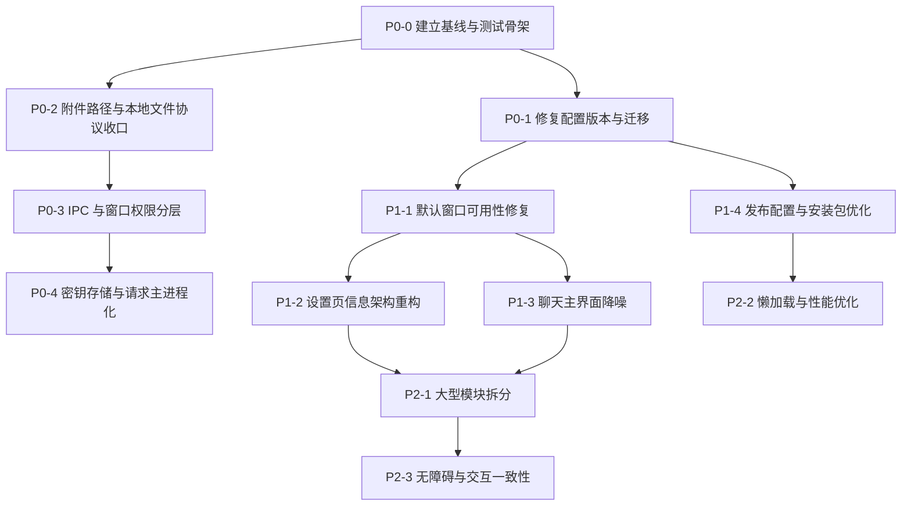

# NeoDeskPet 代码审查修复路线图

- 日期：2026-07-13
- 状态：P1-3 已完成，下一阶段为 P1-4
- 适用项目：NeoDeskPet Electron
- 目标：按风险和依赖顺序修复配置迁移、安全边界、默认窗口体验、发布质量与架构债务

> 本文仅定义开发顺序和验收标准。在用户明确下达执行口令前，不修改运行时代码、不调整配置、不安装新依赖。

## 1. 总体结论

当前项目已经具备桌宠、聊天、长期记忆、任务 Agent、MCP、浏览器控制、视觉路由、TTS、ASR、NovelAI 和悬浮球等完整能力，主要问题已经从“功能缺失”转为以下四类：

1. 数据升级链路存在确定性缺陷，可能影响老用户配置。
2. Electron 高权限能力暴露范围过大，附件路径和密钥需要收口。
3. 默认窗口尺寸与当前信息量不匹配，部分设置入口在新用户默认尺寸下不可见。
4. 核心文件和发布产物持续膨胀，缺少自动化测试作为重构安全网。

推荐执行顺序：

```text
建立验证基线
  -> 修复配置迁移
  -> 收紧文件与 IPC 权限
  -> 改造密钥存储
  -> 修复默认窗口可用性
  -> 重构设置和聊天信息架构
  -> 完善发布配置与缩减体积
  -> 拆分大型模块并补齐长期测试
```

## 2. 优先级定义

| 优先级 | 含义 | 执行原则 |
| --- | --- | --- |
| P0 | 可能导致数据升级错误、敏感信息泄露或高权限能力被滥用 | 在继续扩展功能前完成 |
| P1 | 直接影响新用户可用性、核心操作效率和正式发布质量 | P0 稳定后立即完成 |
| P2 | 影响维护成本、性能、可测试性和无障碍体验 | 可按模块连续推进 |
| P3 | 产品增强和长期体验优化 | 不阻塞当前稳定版本 |

## 3. 依赖关系



## 4. P0-0：建立修复基线与最小测试骨架

### 目标

在修改配置迁移和安全边界前，先建立可以重复执行的验证入口，避免修复过程中出现静默回归。

### 计划改动

- 增加项目级测试命令，优先使用轻量 TypeScript 测试框架。
- 为纯函数和边界校验建立首批测试目录。
- 固化默认窗口截图尺寸：Chat 420 x 560、Settings 420 x 520、Memory 560 x 720、Orb panel 560 x 720。
- 记录当前配置文件、数据库和附件目录的备份策略。
- 将验证命令统一写入 `package.json` 和 `verification.md`。

### 首批必须覆盖的测试

1. 配置迁移版本选择。
2. 配置 normalize 的向后兼容。
3. 本地附件路径允许/拒绝规则。
4. IPC sender 权限判断。
5. Markdown URL 与本地图片路径处理。
6. 聊天消息归并和工具块解析。

### 涉及文件

- `package.json`
- `electron/store.ts`
- `electron/main.ts`
- `src/components/MarkdownMessage.tsx`
- 新增 `tests/` 或与源码同目录的测试文件
- `verification.md`

### 验收标准

- `npm run lint` 通过。
- `npx tsc --noEmit` 通过。
- 新增测试命令可独立运行并通过。
- 测试不依赖真实 API Key、真实模型或用户数据库。
- 默认尺寸基线截图可重复生成。

### 风险与回滚

- 本阶段原则上不改变运行时行为。
- 如果测试依赖与 Electron/Vite 冲突，应先缩小到 Node 侧纯函数测试，不强行引入复杂 E2E 框架。

### P0-0 实施记录（2026-07-13）

- 已使用 Vitest 建立 `npm test` 和 `npm run test:watch`。
- 已新增迁移选择、设置 normalize、媒体路径、IPC 权限、Markdown 本地路径和聊天消息处理测试。
- 已新增 `npm run ui:baseline`，构建后自动生成以下默认尺寸截图：
  - Chat：420 x 560
  - Settings：420 x 520
  - Memory：560 x 720
  - Orb panel：560 x 720
- 截图与布局报告输出到 `artifacts/ui-baseline/`，该目录不进入 Git。
- P0-0 只建立边界与验证能力；迁移版本不一致的实际修复仍属于 P0-1。
- Windows unpacked 打包已通过；验证命令临时关闭 EXE 签名/元数据编辑，以绕过当前机器缺少符号链接权限的问题，未修改项目打包配置。

### 用户数据备份与恢复基线

执行 P0-1、P0-2 或 P0-4 前必须完全退出 NeoDeskPet，并备份整个 Electron `app.getPath('userData')` 目录。最小备份范围包括：

- `neodeskpet-settings.json`
- `neodeskpet-chat.sqlite3` 及可能存在的 `-wal`、`-shm`
- `neodeskpet-memory.sqlite3` 及可能存在的 `-wal`、`-shm`
- `neodeskpet-tasks.json`
- `chat-attachments/`
- 任务输出、视频分析缓存和 debug 日志（按排障需要保留）

备份必须写到 `userData` 目录之外，并使用带时间戳的独立目录或压缩包。恢复时保持应用关闭，先另存失败现场，再整体替换备份文件；不得只恢复 SQLite 主文件而遗漏同一时刻的 WAL/SHM。

## 5. P0-1：修复应用版本与配置迁移

### 已确认问题

- 修复前 `package.json` 版本为 `0.1.0`。
- `electron/store.ts` 中迁移版本已经到 `0.21.0`。
- `electron-store` 默认使用 `app.getVersion()` 作为迁移目标版本。
- 因此当前运行时不会执行 `0.2.0` 到 `0.21.0` 的迁移。

### 实施步骤

1. 确认当前正式发布版本策略，禁止应用版本和迁移版本继续分离。
2. 在执行任何迁移前备份设置、聊天数据库、记忆数据库和任务状态文件。
3. 审核 `0.2.0` 到 `0.21.0` 的每一个迁移，保证重复执行不会破坏数据。
4. 将应用版本提升到不低于当前最高迁移版本，或显式维护独立且可靠的 schema 版本。
5. 增加从典型旧版本配置升级到当前配置的参数化测试。
6. 迁移失败时保留原始配置并显示可恢复错误，不允许直接清空用户配置。

### 推荐决策

- 短期：应用版本与最高迁移版本同步。
- 长期：每次发布先确定应用 semver，再以该版本号新增迁移，不再提前写未来版本迁移。
- 不建议只把 `projectVersion` 硬编码成一个常量后长期遗忘。

### 验收标准

- 全新安装能够生成完整默认配置。
- 从 `0.1.0` 旧配置启动时，所有目标迁移按顺序执行一次。
- 第二次启动不重复执行迁移。
- 未配置字段能够补默认值，用户已有字段不被覆盖。
- 迁移失败时原始文件和备份文件都存在。

### P0-1 实施记录（2026-07-13）

- 应用版本已从 `0.1.0` 同步到最高设置迁移版本 `0.21.0`；测试会阻止应用版本与迁移版本再次分离。
- 未继续依赖 `electron-store/conf` 的内置迁移调度。验证发现其构造阶段可能在迁移执行后用迁移前快照覆盖结果，导致版本不前进和重复迁移；现改为应用内存中按版本顺序迁移，成功后通过同目录临时文件一次性替换配置。
- 设置存储改为在主进程取得单实例锁后初始化，避免第二实例参与备份或迁移。
- 检测到旧配置、损坏配置或降级启动时，会先把完整 `userData` 快照写入同级 `<userData>-backups/` 目录；迁移失败会从快照恢复原设置文件，并显示可恢复错误和备份位置。
- `clearInvalidConfig` 已关闭，损坏 JSON 不再静默清空为默认配置；高版本配置也不会被低版本应用打开后改写。
- 已修复旧 AI 配置迁移对合法零值和视觉开关的覆盖：`temperature: 0`、自定义 token 上限、空 system prompt、视觉与流式开关均按原值保留。
- 已新增典型旧版本参数化测试、全新安装测试、第二次启动幂等测试、全量备份/失败恢复测试、降级保护测试和真实 `electron-store` 初始化集成测试。
- `npm test`、`npm run lint`、`npx tsc --noEmit` 均通过，共 9 个测试文件、27 个用例。
- 前端与 Electron main/preload 构建通过；Windows unpacked 包通过 `npx electron-builder --dir --config.win.signAndEditExecutable=false` 生成到 `release/0.21.0/win-unpacked/`。
- 打包 EXE 使用隔离旧配置完成两次启动 smoke：首次按顺序迁移到 `0.21.0`、创建完整备份并保留用户值；第二次未重复迁移或新增备份。

### 完成后才能进行

- 密钥配置结构调整。
- 默认窗口尺寸迁移。
- 发布版本和安装包命名调整。

## 6. P0-2：收紧附件路径与本地文件访问

### 已确认问题

当前 `chat:getAttachmentUrl`、`chat:readAttachmentDataUrl` 和本地 HTTP 文件服务接受 renderer 传入的绝对路径，缺少目录白名单、一次性授权和资源归属校验。

### 目标架构

```text
renderer: attachmentId / artifactId
        -> main process registry
        -> 解析到已登记的真实路径
        -> 校验允许目录、文件类型和资源状态
        -> 返回短期有效 URL
```

### 实施步骤

1. 建立统一 `LocalMediaRegistry` 或等价模块。
2. 只允许聊天附件、任务输出、截图服务产物和用户明确选择后复制进托管目录的文件登记。
3. 对路径执行 `realpath`，防止 `..`、软链接和目录穿越绕过。
4. 本地 HTTP URL 改用随机资源 token，不包含真实路径。
5. token 设置生命周期，并在应用退出或资源删除后失效。
6. 限制 MIME、文件大小、Range 请求和错误信息。
7. 将 Markdown 本地图片、聊天附件、任务图片和 Orb 预览统一接入注册表。

### 涉及文件

- `electron/main.ts`
- `electron/chatStore.ts`
- `electron/taskService.ts`
- `electron/screenCaptureService.ts`
- `electron/preload.ts`
- `src/neoDeskPetApi.ts`
- `src/components/MarkdownMessage.tsx`
- `src/components/MediaPreviews.tsx`
- `src/windows/ChatWindow.tsx`
- `src/orb/OrbApp.tsx`

### 验收标准

- 任意系统文件路径不能通过 IPC 或本地 HTTP 服务读取。
- 合法聊天附件、任务图片、视频 Range 播放仍然可用。
- URL 中不再出现 Base64 编码后的真实路径。
- 删除资源后旧 URL 不可继续读取。
- 测试覆盖目录穿越、软链接、UNC 路径、大小写差异和不存在文件。

### P0-2 实施记录（2026-07-13）

- 已新增 `LocalMediaRegistry` 与本地媒体 HTTP 服务：资源先经过托管根目录、词法路径和 `realpath` 双重校验，再签发 30 分钟有效的随机 token。
- 本地 URL 已改为 `/media/<opaque-token>`，不再包含明文路径、查询参数路径或 Base64 路径；仅支持 GET/HEAD、单 Range，并限制每段 Range、MIME 和文件大小。
- HTTP 每次读取都会重新验证资源；文件删除、真实路径变化、token 过期或应用退出后，旧 URL 立即失效。
- 允许目录收口到聊天附件、任务输出、屏幕/浏览器截图、MCP 图片、生图产物和视频托管缓存；任意系统路径、UNC、目录穿越、软链接逃逸和不存在文件均被拒绝。
- preload 不再向 renderer 暴露可自行填写的 `sourcePath`。真实拖拽/选择文件通过 Electron `webUtils.getPathForFile(file)` 获取路径，随后复制进 `chat-attachments` 并登记；renderer 伪造 `sourcePath` 不会透传到 IPC。
- 新聊天附件会保存 `resourceId`，旧消息或应用重启后的失效 ID 可用已持久化路径在主进程重新登记；任务产物仍兼容旧路径字段，但必须通过托管目录验证。
- renderer 中所有 `file://` 和本地绝对路径回退已移除。Markdown、Chat、Orb、图片预览和视频播放只有在主进程签发 URL 后才会加载本地媒体。
- `screen.capture` 输出被限制到 `userData/screenshots`；浏览器截图限制到 `task-output` 或 `browser-screenshots`，并校验父目录真实路径；外部 mmvector 视频会先复制到 `video-qa-cache`。
- `npm test`、`npm run lint`、`npx tsc --noEmit` 均通过，共 11 个测试文件、37 个用例；覆盖穿越、软链接、UNC、大小写、不存在文件、MIME/大小、Range、过期和删除失效。
- `npm run media:smoke` 使用打包后的真实 Electron/preload 验证通过：合法聊天附件与相对任务产物可用，外部路径和伪造 `sourcePath` 被拒绝，真实选择文件复制成功，URL 不泄露路径，视频 Range 为 206，删除后旧 URL 为 404。
- `npm run ui:baseline` 通过，Chat、Settings、Memory、Orb 四窗口无 console error、无水平或垂直溢出；Windows unpacked 包已重新生成。

## 7. P0-3：IPC sender 校验与窗口能力分层

### 目标

把“本应用创建的任意 renderer 都拥有全部能力”改为“每种窗口只有完成自身任务所需的最小能力”。

### 实施步骤

1. 为每个 BrowserWindow 注册可信窗口类型和 `webContents.id`。
2. 建立统一 IPC 授权助手，例如 `assertTrustedSender(event, ['chat', 'settings'])`。
3. 按领域拆分 preload API：Pet、Chat、Settings、Memory、Orb 各自只暴露需要的能力。
4. 所有高风险 handler 必须声明允许的窗口类型。
5. 设置 `will-navigate` 和 `setWindowOpenHandler`，应用窗口禁止导航到远程页面，外部链接交给系统浏览器。
6. 拒绝未知窗口、子 frame 和非应用来源调用 IPC。
7. 增加 CSP，并检查 Live2D 脚本加载方式所需的本地白名单。

### 首批高风险 IPC

- `app:quit`
- 所有 `settings:set*`
- `chat:readAttachmentDataUrl`
- `chat:getAttachmentUrl`
- Task 创建、暂停、恢复和取消
- Memory 删除与批量修改
- MCP 配置和同步
- TTS HTTP 代理
- 窗口拖拽和显示模式切换

### 验收标准

- 每个窗口只能调用白名单内 API。
- 远程页面无法获得 NeoDeskPet preload 能力。
- 外部链接不会在带 preload 的 Electron 子窗口中打开。
- 非法 sender 调用会返回统一错误并记录安全日志。
- 正常的 Pet、Chat、Settings、Memory 和 Orb 工作流不受影响。

### P0-3 实施记录（2026-07-13）

- 已为 Pet、Chat、Settings、Memory、Orb 和 Orb Menu 建立可信 `webContents.id -> WindowType` 注册表，窗口销毁时同步撤销身份。
- 118 个 `ipcMain.handle/on` 入口已全部改由统一包装器注册；每次调用都会校验已登记窗口、主 frame、frame URL、当前 webContents URL 和通道白名单，非法调用统一返回 `IpcSecurityError` 并写入安全日志。
- 已建立完整 IPC 权限矩阵和覆盖检查；测试会扫描 `electron/main.ts`，阻止新增未声明通道、重复通道或绕过统一包装器的直接注册。
- preload 会读取主进程注入的窗口类型参数，并按 Pet、Chat、Settings、Memory、Orb、Orb Menu 分别裁剪 API；测试会扫描各窗口源码，防止正常工作流所需方法被遗漏。
- 所有窗口已显式启用 `contextIsolation`、关闭 `nodeIntegration` 并启用 renderer sandbox；未知窗口参数不再暴露 NeoDeskPet API。
- 已设置 `will-navigate`、`will-redirect` 和 `setWindowOpenHandler`：非应用导航被阻止，HTTP/HTTPS 外链交给系统浏览器，Electron 子窗口始终拒绝创建。
- 已增加严格 CSP；Pixi 通过 `@pixi/unsafe-eval@6.5.10` 的无动态代码生成兼容实现运行，不需要在 CSP 中放开 `'unsafe-eval'`。
- 打包验证同时修复了 Live2D 根路径在 `file://` 环境解析到磁盘根目录、生产模型扫描指向不存在的 `app.asar.unpacked` 等问题；默认模型可在 ASAR 包内正常加载。
- `npm test`、`npm run lint`、`npx tsc --noEmit`、Vite/Electron/preload 构建、Windows unpacked 打包、`npm run media:smoke` 和 `npm run ui:baseline` 均通过。
- 新增 `npm run ipc:smoke`：真实启动打包后的 Electron，验证五类主窗口 API 表、无运行时错误、路由伪装拒绝、非法导航阻止和子窗口阻止。

## 8. P0-4：密钥存储与网络请求边界

### 已确认问题

- API Key 位于普通配置对象中。
- `settings:get` 和 `settings:changed` 会把完整 Key 返回所有 renderer。
- 开发环境还会把完整 settings 输出到 console。
- AI 请求主体目前大量位于 renderer 服务中。

### P0-4A：立即止血

- 删除完整 settings console 输出。
- Debug log 增加敏感字段脱敏：`apiKey`、`token`、`authorization`、`password`、Cookie 等。
- 向非设置窗口返回脱敏配置，只保留 `hasApiKey`。
- 设置页保存 Key 时使用独立 IPC，不通过设置广播回传明文。

### P0-4A 实施进度（2026-07-13）

- 已移除 renderer 启动入口对完整 settings 对象的控制台输出。
- Debug log 已增加递归敏感字段脱敏，覆盖 `apiKey`、`authorization`、`password`、Cookie、secret、credential 和字符串 token；同时清洗 Bearer/Basic 凭证及 URL 查询参数中的密钥。
- 数值型 token 用量（例如 `promptTokens`、`completion_tokens`）仍正常保留，便于排障和上下文统计。
- 五类 renderer 窗口接收的 settings 已统一脱敏，只保留 `hasApiKey` / `has...ApiKey` 状态；设置窗口也不会读取已有明文密钥。
- 设置页通过仅 settings 窗口可调用的 `settings:setSecret` 写入或清除密钥；通用设置 IPC 会拒绝携带密钥字段。

### P0-4B：完整改造

- 使用 Electron `safeStorage` 加密密钥。
- 配置文件只保存密钥引用或加密值。
- AI、视觉、Embedding、Reranker、NovelAI 和工具模型请求逐步迁移到主进程。
- renderer 只提交请求参数和 profile ID，不接触明文 Key。
- 提供清除密钥、重新输入和密钥不可解密时的恢复流程。

### 验收标准

- renderer console、debug log、settings 广播中不存在明文 Key。
- 普通窗口无法读取密钥。
- 配置文件中不存在可直接使用的明文 Key。
- 系统密钥不可解密时不会静默丢失其他设置。
- OpenAI 兼容、Claude、视觉、Embedding、NovelAI 和工具 API 均通过回归测试。

### P0-4 完成记录（2026-07-13）

- 新增 `SettingsSecretStore`，使用 Electron `safeStorage` 加密主 AI、AI Profile、NovelAI、工具 AI、自动提炼、向量、多模态向量和 KG 密钥；普通 settings 文件只保留空值，加密值独立写入 `neodeskpet-secrets.json`。
- 首次迁移明文密钥前会创建完整 userData 备份；加密不可用时不改写原配置。密钥文件损坏或不可解密时提供“退出程序”与“保留故障文件并重置密钥后启动”两种明确恢复路径，其他设置不会被删除。
- 新增 renderer settings 投影层，`settings:get`、设置写入返回值、主进程广播和托盘广播全部统一脱敏；打包 smoke 验证 Pet、Chat、Settings、Memory、Orb 五类窗口均无法读取明文 Key。
- Chat、Memory Console 和 Orb 使用受权限控制的主进程 AI HTTP 代理；renderer 只提交请求体和 `main` / `profileId` / `memory-auto-extract` 凭据引用。代理固定使用已配置端点，负责 OpenAI/Claude 鉴权、普通响应、SSE、超时、取消、大小限制和请求归属。
- 视觉 Profile 复用主进程代理；Embedding、Reranker、NovelAI、工具模型和任务 Agent 原有网络请求均位于主进程，密钥只从主进程内存中的解密 settings 获取。
- `npm test` 共 60 个测试通过，覆盖 OpenAI、Claude/Profile、SSE、密钥迁移/恢复、renderer 脱敏和 IPC 权限；TypeScript、lint、UI baseline、Windows unpacked 打包及本地媒体 smoke 均通过。
- `npm run ipc:smoke` 使用隔离 userData 完成两次打包 EXE 启动：普通配置和加密文件均不含测试 Key 明文；重启后 renderer 仍只看到 `hasApiKey`，主进程可解密同一密钥并成功完成鉴权请求。

## 9. P1-1：默认窗口可用性热修复

### 目标

在完整 UI 重构前，先确保新用户默认尺寸下所有功能入口可见、可操作、可恢复。

### 实施步骤

1. 为 Chat、Settings、Memory 设置合理 `minWidth/minHeight`。
2. 调整新用户默认尺寸，建议候选：Chat 720 x 620、Settings 860 x 680、Memory 900 x 720。
3. 对旧用户保留已保存位置，但将过小尺寸迁移到新最小值。
4. 设置页标签在热修阶段至少支持水平滚动或 More 菜单。
5. Chat 顶部状态区在窄窗口下折叠为摘要按钮。
6. 修复 Settings 内容区偶发横向滚动。
7. 增加 100%、125%、150% Windows 缩放测试。

### 验收标准

- 默认尺寸下所有设置入口可见并可访问。
- Chat 消息区域不会被状态区长期占据三分之一。
- 页面无无意的水平滚动条。
- 窗口缩小到最小尺寸后文字、按钮和输入框不重叠。
- 多显示器切换和 DPI 变化后窗口仍可找回。

### P1-1 完成记录（2026-07-13）

- 建立统一窗口尺寸策略：Chat 默认 `720 x 620`、最小 `520 x 500`；Settings 默认 `860 x 680`、最小 `640 x 500`；Memory 默认 `900 x 720`、最小 `640 x 500`。
- 新用户使用新默认尺寸；旧配置中的过小宽高会在 normalize 阶段提升到最小值，同时保留原有 `x/y`。打包 smoke 将当前版本配置改回旧尺寸后重启，三个窗口均恢复到对应最小尺寸。
- BrowserWindow 已设置动态 `minWidth/minHeight`；当工作区本身小于策略最小时优先保证窗口可见。显示器新增、移除或 DPI/工作区变化后，会重新把现有窗口约束到可见区域。
- Settings 顶部标签改为水平滚动，不再压缩成不可读按钮；最小尺寸截图验证可滚到最后一个“语音识别”入口并成功切换。内容区禁止意外横向溢出，表单行可按可用宽度换行。
- Chat 在 `760px` 及以下显示单行状态摘要，完整记忆/工具/视觉状态按需展开；`520 x 500` 展开后状态区高度为 187px，消息区仍保留约 150px，且无横向溢出。
- UI baseline 扩展为 13 个场景，覆盖默认尺寸、最小尺寸和 100%/125%/150% 缩放；横向溢出、console/page error、状态折叠和设置标签滚动均作为失败门禁。
- `npm test` 共 63 个测试通过；TypeScript、lint、Vite/Electron/preload 构建、Windows unpacked 打包、IPC 双启动 smoke 和本地媒体 smoke 均通过。

## 10. P1-2：设置页信息架构重构

### 推荐结构

```text
外观
  - Live2D
  - 气泡
  - 悬浮球 / 任务面板

AI 与能力
  - API 连接
  - 模型与生成
  - 视觉
  - Agent 与工具
  - 生图

角色与知识
  - 角色
  - 长期记忆
  - 设定库

语音
  - TTS
  - ASR

应用
  - 聊天界面
  - 数据与隐私
  - 备份与恢复
  - 关于
```

### 实施原则

- 使用左侧导航，不使用 11 个横向等宽标签。
- 支持设置搜索，搜索结果直接定位到具体字段。
- 高级设置默认折叠，普通用户只看到关键路径。
- API 页面拆分“连接”和“生成参数”，不再维持 3000px 以上单页。
- 对危险操作使用应用内确认对话框，逐步替换 `window.confirm/alert`。
- 每个设置项显示保存状态和错误状态。

### 验收标准

- 任意设置项最多通过两次点击到达。
- 在 860 x 680 下无需水平滚动。
- API 配置主流程无需滚动超过两个视口即可完成。
- 设置搜索能够覆盖标签、说明和常见别名。
- 键盘可以完成导航、修改和保存。

### P1-2 完成记录（2026-07-13）

- Settings 从 11 个横向标签改为左侧分组导航，按“外观 / AI 与能力 / 角色与知识 / 语音 / 应用”组织 14 个直接入口；最小尺寸下侧栏可独立滚动，任意主设置页一次点击即可到达。
- AI 长页拆分为“API 连接 / 模型与生成 / 视觉 / Agent”四个视图，共享原有状态和业务逻辑；上下文压缩参数默认折叠。`860 x 680` 下 API 连接页内容高度为 814px、可视区为 617px，低于两个视口。
- 新增可测试的设置搜索索引，覆盖字段标签、路径、说明词和常见别名；支持方向键、Enter 和 Escape。搜索结果可切换主页面及角色/记忆内部子页，并滚动高亮具体字段。
- UI 门禁验证 `endpoint -> API Base URL`、`向量 -> 角色与长期记忆 / 文本向量` 两条深层定位路径；所有搜索目标都指向已注册导航页面。
- 对所有设置写入 API 增加统一保存状态包装：标题区显示“保存中 / 已保存 / 错误”，当前聚焦设置项同步显示保存反馈；并发写入只由最新请求更新状态。
- 角色删除、记忆删除和设定删除已移除 `window.confirm`，统一使用带焦点、Escape 取消和危险操作样式的应用内确认对话框。
- UI baseline 在 13 个尺寸/缩放场景中增加左侧导航、字段搜索、保存状态、深层子页、AI 拆分、高级折叠和确认对话框门禁；`860 x 680` 与 `640 x 500` 均无横向溢出。
- `npm test` 共 72 个测试通过；TypeScript、lint、Vite/Electron/preload 构建、Windows unpacked 打包、IPC 双启动 smoke 和本地媒体 smoke 均通过。

## 11. P1-3：聊天主界面降噪与输入体验

### 实施步骤

1. 顶栏只保留会话名、新对话、状态摘要、更多菜单和关闭。
2. 将采集、召回、自动提炼、Planner、Tool Agent、游标、阈值、写入数和视觉回执移入“运行状态”抽屉。
3. 将单行 `<input>` 改为自动增高 `<textarea>`：Enter 发送、Shift+Enter 换行，输入法 composing 期间不误发。
4. 图片、视频、附件合并为一个附件菜单。
5. 清空会话移入更多菜单并增加确认。
6. 空状态增加配置模型、选择角色和导入配置入口。
7. 保留高级用户快速开关，但不作为首屏常驻信息。

### 验收标准

- 420 x 560 仍能作为紧凑窗口使用，推荐尺寸下体验完整。
- 输入框支持多行、粘贴、拖拽附件和输入法。
- 关键任务状态可见，但不会长期占据大量高度。
- 停止生成按钮在流式、TTS 和工具任务中行为一致。
- 新用户能够从空状态直接完成模型配置。

### P1-3 完成记录（2026-07-13）

- 聊天顶栏收敛为会话名、新对话、运行状态、更多和关闭；设置、记忆管理及清空当前对话进入“更多”菜单，清空操作使用支持焦点与 Escape 取消的应用内确认对话框。
- 原常驻状态条改为浮层“运行状态”抽屉，采集、召回、自动提炼、Planner、Tool Agent、模式选择、提炼游标、阈值、写入数、召回和视觉回执均保留，但默认不占用消息区高度。
- 输入框改为最高 152px 的自动增高 `<textarea>`，支持 Enter 发送、Shift+Enter 换行、输入法 composing 防误发、图片/视频粘贴与拖拽；三个附件按钮合并为单一附件菜单。
- 空状态增加配置模型、选择角色和导入配置入口；新增设置页直达协议，首次创建设置窗口通过主进程暂存目标并由设置页主动消费，已存在窗口则即时导航。
- 停止按钮统一中断流式请求、停止 TTS、清理分段语音状态并取消当前会话的活动工具任务；UI 门禁验证活动任务取消时同时调用 TTS 停止。
- Chat 最小宽度由 520 调整为 420；UI baseline 在 `420 x 560` 下验证无横向溢出、状态抽屉不挤压消息区、多行增高、输入法保护、附件菜单、设置直达、统一停止和清空确认，并继续覆盖 100% / 125% / 150% 缩放。
- `npm test` 共 72 个测试通过；TypeScript、lint、Vite/Electron/preload 构建、Windows unpacked 打包、IPC 双启动 smoke 和本地媒体 smoke 均通过。当前 Windows 环境打包使用 `--config.win.signAndEditExecutable=false` 绕过已列入 P1-4 的符号链接权限问题。

## 12. P1-4：正式发布配置与安装包优化

### 已确认问题

- `appId`、`productName`、网页标题和图标仍包含模板占位内容。
- `package.json` 缺少 description 和 author。
- 当前 release 目录中的安装包约 263.6 MB。
- `app.asar` 约 344.4 MB，Playwright 浏览器资源约 273.1 MB。
- `files` 显式包含 `node_modules/**/*`，需要核对实际必要范围。

### 实施步骤

1. 确定正式 appId、产品名、描述、作者、图标和安装器名称。
2. 清理 Vite 默认标题和图标。
3. 生成依赖体积报告，确认 asar 中最大的依赖和重复资源。
4. 仅打包生产运行所需文件。
5. 评估 Playwright 浏览器随包附带、首次使用下载、完整版/精简版三种策略。
6. 校验 native 模块的 `asarUnpack` 范围。
7. 处理 Windows 打包符号链接权限问题并固化 CI 打包环境。

### 验收标准

- Windows 安装器、应用名、任务栏和卸载项均显示正式品牌。
- 不再使用 Electron/Vite 默认图标。
- 安装包体积有可解释的组成报告。
- 精简策略不会破坏 `better-sqlite3`、Playwright、Live2D 和 MCP。
- 干净 Windows 环境可完成安装、启动、升级和卸载。

## 13. P2-1：大型模块拆分与领域边界

### 当前重点文件

- `src/windows/ChatWindow.tsx`：约 5441 行
- `electron/taskService.ts`：约 3573 行
- `electron/memoryService.ts`：约 3444 行
- `src/orb/OrbApp.tsx`：约 2792 行
- `electron/main.ts`：约 2496 行
- `electron/toolExecutor.ts`：约 2397 行

### 拆分顺序

1. `electron/main.ts`：按 settings/chat/task/memory/tts/window IPC 分模块注册。
2. `ChatWindow.tsx`：拆出会话、输入、消息列表、附件、上下文状态、AI 请求、TTS/ASR hooks。
3. `taskService.ts`：拆分任务存储、模型循环、工具执行、视觉回执和状态机。
4. `memoryService.ts`：拆分数据库、检索、Embedding、KG、维护任务和版本冲突。
5. `OrbApp.tsx`：拆分 Ball、Bar、Panel、历史、图片查看器和消息操作。

### 约束

- 不进行纯粹为了减少行数的搬运。
- 每次拆分只移动一个明确职责，并先补该职责测试。
- 不在同一提交中同时重写 UI、IPC 契约和数据库结构。
- 保持旧 API 适配层，逐步迁移调用方。

### 验收标准

- 每个拆分模块有清晰输入输出和独立测试入口。
- Chat 流式输出、停止、重发、编辑、附件和 TTS 不回归。
- Task 暂停、恢复、取消、工具重试和状态持久化不回归。
- Memory 检索、批量修改、版本回滚和维护任务不回归。

## 14. P2-2：前端加载与运行性能

### 实施步骤

- 按窗口类型动态加载 Chat、Settings、Memory、Pet 和 Orb。
- Settings 各大页按需加载。
- 分离 Live2D/Pixi、Markdown、Memory Console 等重量模块。
- 为超长消息列表评估虚拟化。
- 审核所有轮询，不可见或非活动页面暂停轮询。
- 合并重复的附件 URL 缓存和图片预览逻辑。
- 建立 bundle 分析和窗口启动耗时基线。

### 验收标准

- Vite 主入口不再维持单个约 1.38 MB 的主 chunk。
- 打开 Chat 时不预加载 Memory Console 和全部 Settings 页面。
- 超长会话滚动和流式输出没有明显掉帧。
- 隐藏窗口不会继续进行不必要的高频轮询。

## 15. P2-3：无障碍与交互一致性

### 实施步骤

- 将可点击 `div/img` 改为 button，或补齐 role、tabIndex 和键盘事件。
- 图标按钮增加明确 accessible name，不只使用 `×`、`+`、`-`。
- 弹窗实现 focus trap、初始焦点和 Esc 关闭。
- 为 tabs 补充正确 tablist/tab/tabpanel 语义。
- 增加 `prefers-reduced-motion` 支持。
- 统一应用内 toast、错误提示、确认对话框和保存状态。
- 检查文本和背景对比度。

### 验收标准

- 只使用键盘可以完成聊天、切换设置、选择会话和关闭弹窗。
- 屏幕阅读器能够识别按钮、标签页、输入错误和加载状态。
- 减少动效模式下不播放非必要缩放和位移动画。

## 16. P3 产品增强候选

以下功能不应抢在 P0/P1 前实施：

1. 首次启动向导：API、模型、角色、视觉和语音快速配置。
2. 数据与隐私中心：显示本轮哪些文本、图片、屏幕内容发送到了哪个 endpoint。
3. 设置、角色、世界书、记忆和聊天的一键备份/恢复。
4. 统一活动中心：展示任务、工具、视觉、TTS、ASR 和后台维护状态。
5. API 配置健康检查和能力探测。
6. 精简版/完整版安装包选择。
7. 崩溃恢复和未发送草稿恢复。

## 17. 推荐提交与交付粒度

每个阶段单独提交，禁止把所有修复堆在一个超大提交中。

推荐顺序：

1. `test: add remediation baseline`
2. `fix: align settings migrations with app version`
3. `security: restrict local media access`
4. `security: validate ipc senders and window navigation`
5. `security: protect api credentials`
6. `fix: make default windows usable`
7. `ui: reorganize settings navigation`
8. `ui: simplify chat controls and composer`
9. `build: finalize branding and package contents`
10. `refactor: split ipc and chat domains`

每个提交必须附带变更范围、兼容性说明、测试结果、手工 smoke、回滚方式和剩余风险。

## 18. 全量回归矩阵

### 数据

- 全新安装、旧配置升级、配置损坏恢复。
- 聊天、记忆和任务数据保留。

### 窗口

- Live2D、Chat、Settings、Memory、Orb ball/bar/panel。
- 100%、125%、150% DPI。
- 单屏、多屏、拔插显示器、位置恢复。

### AI

- OpenAI-compatible、Claude Messages。
- 流式与非流式、主模型视觉和外挂视觉。
- 上下文压缩、Tool Agent native/text/auto。

### 媒体与语音

- 图片、视频、拖拽、粘贴、本地预览。
- TTS 普通、分句、流式、取消。
- ASR 手动发送和自动发送。

### Agent 与记忆

- 任务创建、暂停、恢复、取消和重启恢复。
- MCP 启停和工具刷新。
- 记忆召回、自动提炼、批量管理和版本回滚。
- 屏幕截图、浏览器截图和工具图片回显。

### 发布

- 安装、升级、卸载、离线启动。
- 精简资源缺失时的提示。
- Windows 普通用户权限运行。

## 19. 完成定义

一个阶段只有同时满足以下条件才算完成：

1. 代码实现完成。
2. 相关自动化测试通过。
3. `npm run lint` 通过。
4. `npx tsc --noEmit` 通过。
5. Vite 构建通过。
6. 涉及 Electron 主进程、native 模块或打包配置时，完整打包通过。
7. 对应默认尺寸界面完成截图检查。
8. `verification.md` 记录实际验证结果和未覆盖风险。
9. 没有顺手修改无关模块。

## 20. 执行口令约定

在收到以下类型的明确口令前，本路线图保持“只读待审核”状态：

- `开始执行 P0-0`
- `开始执行 P0-1`
- `开始执行 P0 全部`
- `开始执行 P1-1 和 P1-3`
- `按路线图从头开始修复`

如果口令只写“开始修复”，默认从 **P0-0** 开始，只完成该阶段并提交验证结果，不自动跨阶段继续。

如果用户要求跳过某一前置阶段，应先说明由此增加的具体风险，再按用户最终确认的范围执行。
